# LabReportParser V3.0 软件详细设计说明书


# 文档信息

| 项目 | 内容 |
|------|------|
| 项目名称 | LabReportParser V3.0 |
| 中文名称 | 医学检验报告智能解析与管理平台 |
| 英文名称 | Laboratory Report Intelligent Parsing and Management Platform |
| 文档类型 | Software Design Specification（SDS） |
| 文档版本 | V3.0 |
| Volume | Volume 1 |
| 编写语言 | Markdown |
| 数据库 | MySQL 8.0 |
| 后端 | Python 3.12 + FastAPI |
| 前端 | Vue3 + TypeScript |
| OCR | PaddleOCR |
| PDF解析 | PyMuPDF + pdfplumber |
| 图片处理 | OpenCV |
| 作者 | ChatGPT |
| 创建日期 | 2026-07-14 |

---

# 修订记录

| 日期 | 版本 | 修改内容 |
|------|------|----------|
|2026-07-14|V3.0|初始版本|

---

# 目录

# 第一章 项目概述

1. 项目背景

2. 项目目标

3. 建设原则

4. 功能范围

5. 系统边界

6. 使用对象

7. 名词解释

---

# 第二章 需求分析

1. 功能需求

2. 非功能需求

3. 性能需求

4. 安全需求

5. 扩展需求

---

# 第三章 系统总体架构

1. 总体架构

2. 技术架构

3. 系统模块

4. 数据流

5. 部署架构

---

# 第四章 技术选型

---

# 第五章 系统模块设计

---

# 第六章 OCR设计

---

# 第七章 PDF解析设计

---

# 第八章 图片解析设计

---

# 第九章 医院模板识别设计

---

# 第十章 标准化设计

---

# 第一章 项目概述

---

# 1.1 项目背景

随着我国医疗信息化建设的不断推进，各级医院均已实现检验报告电子化。

目前主流检验报告主要以 PDF、扫描 PDF、JPG、PNG 等格式提供。

由于不同医院使用不同的 LIS（Laboratory Information System）供应商，导致检验报告存在以下问题：

- 页面布局差异较大
- 检验项目名称不统一
- 单位不统一
- 参考范围表达方式不同
- 异常标记方式不同
- PDF 既有文字版，也有扫描版
- 图片质量差异较大

例如，同一个指标在不同医院可能出现如下表示方式：

| 医院 | 项目名称 |
|------|----------|
| 医院A | ALT |
| 医院B | GPT |
| 医院C | 谷丙转氨酶 |
| 医院D | Alanine Aminotransferase |

这些数据无法直接进行统一分析。

因此，需要开发一套智能解析平台，对不同医院、不同格式的医学检验报告进行统一解析、标准化和管理。

---

# 1.2 项目目标

LabReportParser V3.0 的总体目标包括：

## 1.2.1 自动解析

支持自动解析以下文件类型：

- PDF（文字版）
- PDF（扫描版）
- JPG
- JPEG
- PNG
- BMP
- TIFF
- WEBP

系统能够自动识别文件类型，无需用户指定解析方式。

---

## 1.2.2 自动 OCR

对于扫描 PDF 和图片文件，系统自动调用 PaddleOCR 完成文字识别。

OCR 结果需保留：

- 原始文本
- Bounding Box 坐标
- 识别置信度
- 页面编号

所有 OCR 数据均可追溯。

---

## 1.2.3 自动识别医院

系统根据以下信息综合判断医院：

- 医院 Logo
- 医院名称
- 页眉
- 固定模板
- 科室名称
- 地址
- 联系电话

识别成功后自动加载对应医院解析模板。

若无法识别，则使用通用解析器（Common Parser）。

---

## 1.2.4 自动识别检验指标

自动提取：

- 检验项目名称
- 检验项目缩写
- 检验结果
- 单位
- 参考范围
- 异常标记
- 检验日期
- 采样日期
- 医院名称

所有字段均建立统一数据模型。

---

## 1.2.5 自动标准化

系统建立统一医学指标库。

例如：

| 原始名称 | 标准名称 | 缩写 |
|----------|----------|------|
| GPT | 谷丙转氨酶 | ALT |
| ALT | 谷丙转氨酶 | ALT |
| Alanine Aminotransferase | 谷丙转氨酶 | ALT |

统一后的数据可直接进行统计分析。

---

## 1.2.6 自动入库

所有解析数据统一存入 MySQL。

同时保存：

- 原始文件
- OCR 数据
- 页面图片
- 缩略图
- Bounding Box
- 标准化结果
- 原始结果

实现完整的数据追溯能力。

---

## 1.2.7 在线预览

系统支持在线查看原始化验单。

支持：

- PDF 浏览
- 图片浏览
- OCR 高亮
- 点击指标定位
- 缩放
- 翻页

用户点击任意检验指标，即可定位到原始化验单对应位置。

---

## 1.2.8 趋势分析

根据历史检验结果生成趋势图。

支持：

- ALT
- AST
- CEA
- AFP
- HbA1c
- 血糖
- 血脂
- 肾功能
- 肝功能
- 血常规
- 尿常规

所有趋势图采用 ECharts 实现。

---

# 1.3 建设原则

系统设计遵循以下原则。

## 1.3.1 模块化

系统划分为独立模块：

- 上传模块
- OCR模块
- Parser模块
- 标准化模块
- 数据库模块
- API模块
- 前端模块

模块之间通过接口通信。

---

## 1.3.2 插件化

医院模板采用插件机制。

新增医院无需修改主程序。

每家医院对应一个 Parser。

例如：

```
PekingUnionParser

RuijinHospitalParser

WestChinaHospitalParser

CommonParser
```

Parser 自动注册。

运行时动态加载。

---

## 1.3.3 配置化

所有规则采用配置文件。

例如：

医院模板：

```yaml
hospital:
    name: 北京协和医院

    keywords:

      - 北京协和医院

      - PUMCH
```

标准指标：

```yaml
ALT:

    alias:

      - GPT

      - 谷丙转氨酶

      - Alanine Aminotransferase
```

所有配置均可热更新。

---

## 1.3.4 可扩展

后续可扩展：

- AI Parser
- LLM OCR 修正
- MinIO
- OSS
- S3
- PostgreSQL
- Oracle
- 多租户

无需修改核心架构。

---

## 1.3.5 可维护

统一：

- 日志
- 配置
- 数据模型
- 接口规范
- 错误码

降低维护成本。

---

## 1.3.6 高性能

支持：

- 多线程 OCR
- 多进程解析
- Celery 队列
- Redis 缓存
- 批量导入

目标：

1000 份检验报告可连续解析。

---

## 1.3.7 数据可追溯

每一个检验结果均记录：

- 来源文件
- 页码
- OCR 坐标
- OCR 文本
- OCR 置信度
- 原始项目名称
- 标准化名称
- 导入时间
- 修改历史

任何修改均保留历史版本。

---

# 1.4 系统功能范围

系统包括以下业务模块：

| 模块 | 功能 |
|------|------|
| 上传中心 | 上传目录、文件、图片 |
| OCR | 图片文字识别 |
| PDF解析 | 提取文字 PDF |
| 图片解析 | OCR 图片 |
| 医院识别 | 自动识别医院 |
| 标准化 | 指标统一 |
| 数据管理 | MySQL |
| 在线预览 | PDF.js |
| 趋势分析 | ECharts |
| 导出中心 | Excel、CSV |
| 用户管理 | 登录、权限 |
| 配置中心 | 医院模板、标准库 |
| 审计日志 | 操作追踪 |

---
```
````
````markdown
# 1.5 系统边界

系统边界用于明确 LabReportParser V3.0 的职责范围，避免与医院 HIS、LIS、EMR 等业务系统产生职责重叠。

## 1.5.1 系统负责内容

LabReportParser V3.0 负责完成以下业务。

### 文件管理

支持：

- 整个目录上传
- 单个文件上传
- 多文件上传
- 拖拽上传
- ZIP（预留）
- 网络共享目录（预留）

自动递归扫描目录。

支持子目录。

自动过滤非支持文件。

---

### 文件格式支持

支持：

| 类型 | 是否支持 |
|-------|----------|
| PDF（文字） | √ |
| PDF（扫描） | √ |
| JPG | √ |
| JPEG | √ |
| PNG | √ |
| TIFF | √ |
| BMP | √ |
| WEBP | √ |

后续预留：

- HEIF
- DICOM截图
- 手机Live Photo

---

### OCR

负责：

- 图片OCR
- PDF图片OCR
- OCR缓存
- OCR坐标
- OCR置信度

不负责：

OCR算法研发。

系统调用 PaddleOCR 即可。

---

### 文档解析

负责：

自动识别：

- 医院
- 科室
- 检验日期
- 采样日期
- 报告日期
- 检验项目
- 单位
- 参考范围
- 异常标记

自动生成统一数据结构。

---

### 数据标准化

负责：

统一：

项目名称

项目缩写

单位

参考范围

异常标记

例如：

```
GPT

↓

ALT
```

```
谷丙转氨酶

↓

ALT
```

---

### 数据管理

负责：

MySQL

数据：

新增

查询

修改

删除

导出

版本管理

审计。

---

### 在线预览

负责：

PDF

图片

OCR定位

Bounding Box

缩放

翻页

高亮。

---

### 数据分析

负责：

趋势分析。

例如：

ALT

AST

CEA

AFP

HbA1c

自动生成：

折线图

柱状图

异常统计。

---

### 人工校对

负责：

人工修改：

OCR结果

标准化结果

医院识别

单位

参考范围

所有修改均记录。

---

### 数据导出

支持：

Excel

CSV

JSON（预留）

XML（预留）

FHIR（预留）

---

# 1.5.2 系统不负责内容

以下业务不属于本系统。

| 功能 | 是否负责 |
|------|----------|
| HIS | × |
| LIS | × |
| PACS | × |
| EMR | × |
| 医院收费 | × |
| 医保结算 | × |
| 挂号 | × |
| 医疗诊断 | × |
| 医嘱管理 | × |
| 检验仪器控制 | × |

系统仅负责：

**检验报告数据管理。**

---

# 1.6 使用对象

本系统面向以下用户。

## 1.6.1 普通用户

个人健康档案管理。

功能：

上传

查询

趋势分析

导出。

---

## 1.6.2 医生

查看：

长期趋势

指标变化

异常情况。

辅助分析患者历史检验结果。

---

## 1.6.3 科研人员

批量收集：

实验数据。

统计分析。

导出CSV。

支持科研。

---

## 1.6.4 数据管理员

维护：

标准指标

医院模板

单位

配置

数据质量。

---

## 1.6.5 系统管理员

维护：

服务器

数据库

Redis

Docker

日志

用户权限。

---

# 1.7 系统业务流程

## 1.7.1 总体流程

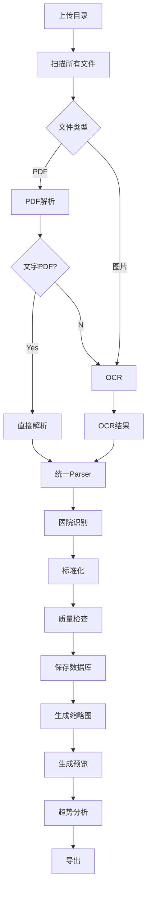

---

## 1.7.2 上传流程

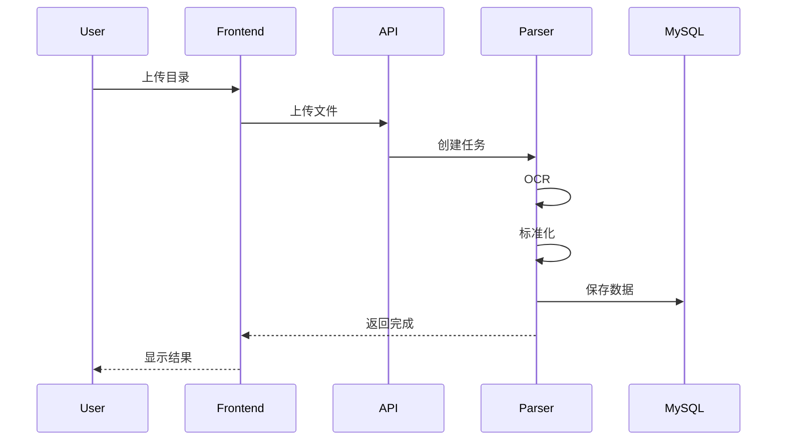

---

## 1.7.3 在线预览流程

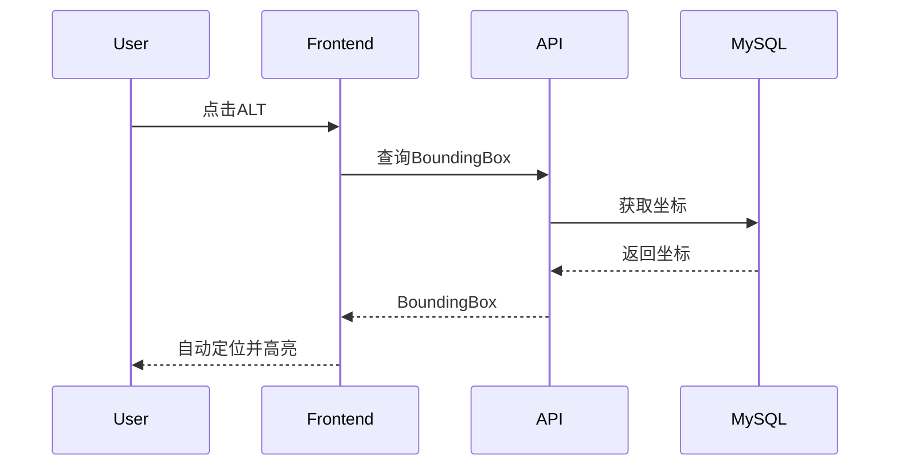

---

# 1.8 系统特点

相比普通OCR软件，本系统具有以下特点。

## 多医院统一

无需配置。

自动识别：

医院。

自动解析。

---

## 多格式统一

PDF

图片

扫描件

全部统一解析。

---

## OCR缓存

OCR一次。

永久保存。

避免重复OCR。

---

## 全流程追溯

任何数据均可追溯：

来源文件

页码

OCR文本

OCR坐标

修改记录

导入时间。

---

## 自动标准化

统一：

ALT

AST

CEA

AFP

HbA1c

所有医院保持一致。

---

## 在线定位

点击：

ALT

立即定位：

PDF

对应位置。

无需人工查找。

---

## 批量处理

支持：

整个目录。

几千份报告。

连续解析。

---

## 插件化医院模板

新增医院：

无需修改：

核心程序。

仅新增：

HospitalParser。

---

## AI扩展

预留：

LLM接口。

以后支持：

OCR纠错

医院识别

自动标准化

智能趋势分析

自然语言查询。

---

# 1.9 技术目标

系统目标如下。

| 指标 | 目标 |
|------|------:|
| OCR识别率 | ≥98%（清晰扫描件） |
| 医院识别率 | ≥99% |
| 指标识别率 | ≥99% |
| 标准化成功率 | ≥98% |
| 单份解析时间 | ≤5秒（普通PDF） |
| 批量解析 | ≥1000份 |
| 在线查询响应 | ≤500ms |
| Excel导出 | ≤10秒（10000条） |

---

# 1.10 兼容性目标

## 操作系统

支持：

- Windows 10
- Windows 11
- Ubuntu 22+
- Debian
- CentOS Stream
- Rocky Linux

---

## 浏览器

支持：

- Chrome
- Edge
- Firefox

推荐：

Chrome 最新版。

---

## Python版本

推荐：

Python 3.12+

最低：

Python 3.11

---

## MySQL版本

推荐：

MySQL 8.0

兼容：

MariaDB（部分功能需验证）

---

## 部署方式

支持：

- 本地部署
- Docker Compose
- Kubernetes（V4.0规划）

---

# 1.11 本章总结

本章介绍了 LabReportParser V3.0 的项目背景、建设目标、系统边界、业务流程、使用对象、核心特点及技术目标，明确了系统定位和建设范围，为后续需求分析与系统架构设计提供基础。

---

# 第二章 需求分析

## 2.1 概述

需求分析用于定义系统需要实现的功能、性能、安全性及扩展能力，是系统设计和开发的依据。

本章将从业务需求、功能需求、非功能需求、性能需求、安全需求及未来扩展需求等方面进行详细说明。

```
````
````markdown
## 2.2 业务需求分析

### 2.2.1 建设目标

系统建设目标包括：

1. 自动解析不同医院化验单
2. 自动识别扫描版 PDF
3. 自动识别图片
4. 自动标准化检验项目
5. 建立统一数据库
6. 建立统一查询平台
7. 建立统一预览平台
8. 建立统一趋势分析平台
9. 支持后续 AI 扩展

系统最终形成一个完整的医学检验报告数据中心。

---

## 2.2.2 当前业务痛点

目前用户通常保存大量不同医院的 PDF 和图片。

例如：

```
LabReport/

    协和医院/

        2021.pdf

        2022.pdf

    瑞金医院/

        report01.pdf

    华西医院/

        IMG001.jpg

        IMG002.png
```

存在以下问题：

### （1）医院格式不统一

不同医院：

- 页面布局不同
- 字段顺序不同
- 项目名称不同
- 字体不同
- 表格结构不同

导致无法统一整理。

---

### （2）人工录入效率低

每份报告需要：

- 打开 PDF
- 查看项目
- 输入 Excel
- 校对

几百份报告需要数天。

容易出错。

---

### （3）历史数据无法分析

例如：

ALT：

```
2021

2022

2023

2024
```

散落在几十份 PDF。

无法自动生成趋势。

---

### （4）扫描件无法处理

大量历史报告仅保存为：

- 扫描 PDF
- JPG
- PNG

需要 OCR。

---

### （5）项目名称不统一

例如：

| 医院 | 项目 |
|------|------|
| A | ALT |
| B | GPT |
| C | 谷丙转氨酶 |
| D | Alanine Aminotransferase |

统计分析困难。

---

### （6）无法追溯

Excel 中：

```
ALT = 35
```

不知道：

来自哪份报告。

哪一页。

OCR 是否识别错误。

---

### （7）无法人工校对

OCR 错误后：

没有修改入口。

也没有历史记录。

---

## 2.2.3 建设后的业务流程


整个流程无需人工录入。

---

# 2.3 功能需求

系统划分为十大业务模块。

| 编号 | 模块 | 是否必须 |
|------|------|----------|
| FR-001 | 上传中心 | √ |
| FR-002 | OCR识别 | √ |
| FR-003 | PDF解析 | √ |
| FR-004 | 医院模板 | √ |
| FR-005 | 标准化 | √ |
| FR-006 | 数据管理 | √ |
| FR-007 | 在线预览 | √ |
| FR-008 | 趋势分析 | √ |
| FR-009 | 导出 | √ |
| FR-010 | 系统管理 | √ |

---

# 2.4 上传中心需求

## FR-001

支持上传：

### 整个目录

例如：

```
D:\private\CS\CS\LabReport
```

自动：

递归。

扫描。

上传。

---

### 单个文件

例如：

```
001.pdf
```

立即解析。

---

### 多文件

例如：

```
001.pdf

002.pdf

003.png
```

支持一次上传。

---

### 拖拽上传

浏览器：

拖进去即可。

---

### 上传限制

默认：

| 参数 | 值 |
|------|----|
| 单文件 | 100MB |
| 单次上传 | 5000个 |
| 最大目录 | 不限制 |
| 支持子目录 | √ |

可配置。

---

### 文件过滤

自动过滤：

```
txt

doc

xls

zip

exe
```

仅解析支持格式。

---

# 2.5 OCR需求

## FR-002

自动判断：

```
PDF

↓

文字？

↓

Yes

↓

直接解析
```

否则：

```
OCR
```

---

OCR要求：

识别：

- 中文
- 英文
- 数字
- 符号
- ↑
- ↓
- H
- L

全部支持。

---

保存：

OCR：

```
文本

坐标

置信度
```

---

支持：

多页。

---

支持：

横版。

---

支持：

旋转。

---

支持：

倾斜校正。

---

支持：

图片增强。

---

支持：

OCR缓存。

---

# 2.6 PDF解析需求

## FR-003

支持：

文字 PDF。

自动读取：

- 文本
- 表格
- 页码
- 字体

无需 OCR。

---

扫描 PDF：

自动：

转换：

图片。

OCR。

---

支持：

多页。

---

支持：

混合 PDF。

例如：

第一页：

文字。

第二页：

扫描。

系统自动处理。

---

# 2.7 图片解析需求

支持：

```
JPG

PNG

BMP

TIFF

WEBP
```

自动：

OCR。

支持：

300dpi

600dpi

扫描。

支持：

手机拍照。

支持：

图片去噪。

支持：

自动旋转。

支持：

透视校正（预留）。

---

# 2.8 医院识别需求

自动识别：

医院。

例如：

第一页：

```
北京协和医院
```

立即：

Hospital=

```
北京协和医院
```

自动：

Parser=

```
PekingUnionParser
```

---

识别依据：

Logo。

医院名称。

电话。

地址。

页眉。

模板。

综合判断。

---

未知医院：

使用：

CommonParser。

---

医院模板：

后台可新增。

无需修改代码。

---

# 2.9 检验项目识别需求

自动读取：

| 字段 | 是否必须 |
|------|----------|
| 项目名称 | √ |
| 项目缩写 | √ |
| 检验结果 | √ |
| 单位 | √ |
| 参考范围 | √ |
| 异常标记 | √ |
| 检验日期 | √ |
| 医院名称 | √ |
| 来源文件 | √ |
| 页码 | √ |
| OCR坐标 | √ |

所有字段均保存数据库。

---

支持：

文本。

数字。

定性结果。

例如：

```
阴性

阳性

++

+++

Weak Positive
```

均可保存。

---

# 2.10 标准化需求

统一：

所有医院。

例如：

| 原始名称 | 标准名称 | 缩写 |
|-----------|----------|------|
| GPT | 谷丙转氨酶 | ALT |
| ALT | 谷丙转氨酶 | ALT |
| Alanine Aminotransferase | 谷丙转氨酶 | ALT |

---

单位：

统一：

例如：

```
IU/L

U/L
```

统一：

```
U/L
```

---

异常：

统一：

```
↑

High

H
```

↓

```
H
```

统一：

```
↓

Low

L
```

↓

```
L
```

---

参考范围：

例如：

```
3.5~5.5
```

统一：

```
reference_low

reference_high
```

便于统计分析。

---

（Volume 1 未完，下一部分继续第 2 章：非功能需求、性能需求、安全需求、详细业务规则与用例分析。）
````

````markdown
## 2.11 非功能需求

非功能需求定义系统在可靠性、性能、安全性、可维护性、可扩展性等方面必须满足的要求。

---

### NFR-001 可用性

系统全年可用率：

```
≥99.9%
```

除系统升级外，应保持持续运行。

支持：

- 长时间运行
- 长时间批量解析
- 后台自动恢复

---

### NFR-002 易用性

用户无需了解 OCR。

无需了解 PDF。

无需了解数据库。

整个流程：

```
上传

↓

等待

↓

查看结果
```

完成全部工作。

---

### NFR-003 可维护性

整个系统必须采用模块化设计。

例如：

```
Upload

OCR

Parser

Normalizer

Exporter

API

Frontend
```

每个模块独立。

避免模块之间互相依赖。

---

### NFR-004 可扩展性

以后新增：

医院

↓

新增 Parser

即可。

以后新增：

OCR

↓

替换 OCR Adapter。

以后新增：

数据库

↓

新增 Database Adapter。

无需修改业务代码。

---

### NFR-005 可配置性

以下内容全部配置化：

医院模板

标准指标

单位

OCR参数

线程数

缓存大小

导出格式

上传限制

日志等级

数据库连接

Redis连接

全部放入：

```
config.yaml
```

或数据库。

禁止硬编码。

---

### NFR-006 可测试性

所有核心模块：

必须：

单元测试。

接口测试。

集成测试。

压力测试。

---

### NFR-007 国际化

预留：

中文

英文

日文

语言包。

所有提示信息：

禁止硬编码。

---

### NFR-008 可部署性

支持：

Windows

Linux

Docker Compose

后续支持：

Kubernetes。

---

# 2.12 性能需求

系统目标：

支持：

个人电脑。

服务器。

云服务器。

均可运行。

---

## 2.12.1 OCR性能

普通扫描 PDF：

```
≤5秒
```

一份。

300dpi。

---

批量：

1000份：

连续解析。

---

OCR：

支持：

多线程。

---

## 2.12.2 查询性能

查询：

单份报告：

```
≤300ms
```

---

查询：

历史趋势：

```
≤500ms
```

---

查询：

10万条结果：

```
≤2秒
```

---

## 2.12.3 导出性能

Excel：

10000条：

```
≤10秒
```

CSV：

100000条：

```
≤5秒
```

---

## 2.12.4 上传性能

目录：

5000份：

连续上传。

支持：

断点续传（预留）。

---

## 2.12.5 数据库性能

目标：

100万条：

LabResult。

查询：

仍保持：

亚秒级。

数据库建立：

合理索引。

---

# 2.13 安全需求

系统仅用于医学检验数据整理与分析。

应保证：

数据安全。

用户安全。

文件安全。

---

## 2.13.1 登录认证

采用：

JWT。

支持：

登录。

退出。

Token刷新。

---

## 2.13.2 权限控制

采用：

RBAC。

角色：

```
管理员

医生

普通用户

只读用户
```

权限不同。

---

## 2.13.3 上传安全

禁止：

```
exe

dll

bat

cmd

js
```

上传。

仅允许：

白名单。

---

## 2.13.4 SQL安全

采用：

ORM。

禁止：

字符串拼SQL。

防止：

SQL Injection。

---

## 2.13.5 XSS

前端：

统一：

HTML Escape。

防止：

XSS。

---

## 2.13.6 CSRF

采用：

JWT。

REST API。

避免：

CSRF。

---

## 2.13.7 文件安全

所有上传文件：

计算：

MD5

SHA256。

避免：

重复上传。

损坏文件。

---

## 2.13.8 审计日志

所有：

修改：

必须记录：

修改前。

修改后。

修改人。

修改时间。

IP。

浏览器。

---

# 2.14 数据需求

系统统一保存以下数据。

---

## 报告

保存：

```
Report
```

包括：

医院。

日期。

来源文件。

页数。

OCR状态。

---

## 页面

保存：

```
ReportPage
```

包括：

页码。

图片。

缩略图。

---

## OCR

保存：

```
OCRBlock
```

包括：

文本。

坐标。

置信度。

---

## 检验项目

保存：

```
LabItem
```

包括：

标准名称。

缩写。

英文。

分类。

---

## 检验结果

保存：

```
LabResult
```

包括：

原始名称。

标准名称。

单位。

参考范围。

异常。

OCR坐标。

来源文件。

页码。

---

## 医院

保存：

```
Hospital
```

包括：

医院名称。

Parser。

模板。

---

## 上传任务

保存：

```
UploadTask
```

包括：

状态。

进度。

开始时间。

结束时间。

---

## 审计

保存：

```
AuditLog
```

包括：

所有修改。

---

# 2.15 用户用例分析

## UC-001 上传目录

参与者：

用户。

前置条件：

登录。

流程：

```
选择目录

↓

上传

↓

后台解析

↓

完成
```

结果：

数据入库。

---

## UC-002 上传图片

参与者：

用户。

流程：

```
上传图片

↓

OCR

↓

解析

↓

标准化

↓

保存
```

---

## UC-003 查看报告

流程：

```
打开报告

↓

查看所有指标

↓

点击ALT

↓

自动定位PDF
```

---

## UC-004 修改OCR

流程：

```
点击结果

↓

修改

↓

保存

↓

记录日志
```

---

## UC-005 趋势分析

流程：

```
选择ALT

↓

生成趋势图

↓

导出Excel
```

---

# 2.16 业务规则

系统采用统一业务规则。

---

## BR-001

一份报告：

对应：

一个：

```
Report
```

---

## BR-002

一页：

对应：

一个：

```
ReportPage
```

---

## BR-003

一个OCR区域：

对应：

一个：

```
OCRBlock
```

---

## BR-004

一个检验结果：

对应：

一个：

```
LabResult
```

---

## BR-005

所有：

LabResult

必须：

关联：

来源文件。

页码。

Bounding Box。

---

## BR-006

标准化：

不得：

覆盖：

原始数据。

必须：

保存：

```
Raw

Normalized
```

两套数据。

---

## BR-007

人工修改：

不得：

删除：

OCR值。

必须：

保留：

OCR值。

人工值。

修改历史。

---

## BR-008

删除报告：

采用：

逻辑删除。

保留：

历史。

---

## BR-009

导入：

重复文件。

根据：

MD5。

判断。

默认：

跳过。

可配置：

重新解析。

---

## BR-010

所有：

解析异常。

必须：

进入：

异常队列。

等待：

人工处理。

不得：

直接丢弃。

---

# 2.17 本章总结

本章完成了系统需求分析，包括业务需求、功能需求、非功能需求、性能需求、安全需求、数据需求、用户用例及业务规则。

后续章节将在此基础上完成系统总体架构设计、模块设计及数据库设计。

---

# 第三章 系统总体架构

## 3.1 概述

LabReportParser V3.0 采用前后端分离架构，遵循高内聚、低耦合、模块化、插件化设计原则。

系统核心由上传服务、解析引擎、OCR 引擎、标准化服务、数据库、文件存储、REST API 和前端应用组成。

后续将详细介绍整体架构、模块关系、数据流及部署架构。
````
````markdown
## 3.2 总体架构设计

LabReportParser V3.0 采用经典的 **Browser / API / Service / Storage** 四层架构。

整个系统划分为：

```
┌─────────────────────────────────────────────────────────────┐
│                        Browser                              │
│             Vue3 + TypeScript + Element Plus                │
└─────────────────────────────────────────────────────────────┘
                          │
                          │ HTTPS / REST API
                          ▼
┌─────────────────────────────────────────────────────────────┐
│                      FastAPI Gateway                        │
│             JWT │ Upload │ Query │ Export API               │
└─────────────────────────────────────────────────────────────┘
                          │
            ┌─────────────┼─────────────────────┐
            ▼             ▼                     ▼
     Upload Service   Parse Service      Query Service
            │             │                     │
            │             ▼                     │
            │      OCR / PDF Parser             │
            │             ▼                     │
            │      Hospital Recognizer          │
            │             ▼                     │
            │      Data Normalizer              │
            │             ▼                     │
            └────────────►MySQL◄────────────────┘
                          │
                          ▼
                   File Storage
```

系统各层职责明确：

| 层 | 职责 |
|-----|------|
| Presentation | 用户交互 |
| API | REST接口 |
| Service | OCR、解析、标准化 |
| Persistence | MySQL、文件存储 |

---

# 3.3 架构设计原则

系统采用以下设计原则。

---

## 3.3.1 单一职责原则（SRP）

每个模块只负责一项工作。

例如：

UploadService

仅负责：

```
上传
```

OCRService

仅负责：

```
OCR
```

Normalizer

仅负责：

```
标准化
```

Exporter

仅负责：

```
导出
```

避免：

一个模块完成所有工作。

---

## 3.3.2 开闭原则（OCP）

新增：

医院 Parser

无需修改已有 Parser。

例如：

```
BaseParser

      ▲

      │

HospitalParserA

HospitalParserB

HospitalParserC
```

后续：

新增：

```
HospitalParserD
```

无需修改已有代码。

---

## 3.3.3 依赖倒置原则（DIP）

所有业务模块依赖：

```
Interface
```

例如：

OCR：

```
OCRService

↓

PaddleOCRAdapter
```

以后：

更换：

EasyOCR。

无需修改：

业务代码。

---

## 3.3.4 插件化设计

医院模板：

全部：

Plugin。

例如：

```
plugins/

    hospital/

        peking_union.py

        ruijin.py

        west_china.py
```

启动：

自动加载。

---

## 3.3.5 配置驱动

例如：

```
config/

    config.yaml

    parser.yaml

    hospital.yaml

    unit.yaml
```

所有规则：

均来自配置。

不是：

Python代码。

---

# 3.4 系统模块划分

整个系统划分为十三个一级模块。

```
LabReportParser

├── Upload

├── Task

├── OCR

├── PDF

├── Parser

├── Hospital

├── Normalize

├── Preview

├── Export

├── Trend

├── System

├── User

└── API
```

---

## 3.4.1 Upload 模块

负责：

文件上传。

支持：

目录。

图片。

PDF。

拖拽。

批量。

主要职责：

```
接收文件

验证

创建任务

保存原文件
```

---

## 3.4.2 Task 模块

负责：

任务生命周期。

包括：

```
等待

运行

暂停

失败

完成
```

支持：

进度。

日志。

取消。

重试。

---

## 3.4.3 OCR 模块

负责：

图片识别。

支持：

图片增强。

OCR缓存。

BoundingBox。

OCR JSON。

---

## 3.4.4 PDF 模块

负责：

PDF。

判断：

```
文字PDF

扫描PDF
```

支持：

多页。

混合PDF。

旋转。

---

## 3.4.5 Parser 模块

负责：

真正解析：

字段。

例如：

```
ALT

35

U/L

9~50

↑
```

Parser：

输出：

统一数据结构。

---

## 3.4.6 Hospital 模块

负责：

识别医院。

选择：

Parser。

支持：

模板管理。

---

## 3.4.7 Normalize 模块

负责：

统一：

项目。

单位。

参考范围。

异常。

日期。

输出：

标准数据。

---

## 3.4.8 Preview 模块

负责：

在线：

PDF。

图片。

OCR定位。

Bounding Box。

高亮。

---

## 3.4.9 Export 模块

负责：

Excel。

CSV。

JSON（预留）。

FHIR（预留）。

---

## 3.4.10 Trend 模块

负责：

趋势分析。

统计。

图表。

ECharts。

---

## 3.4.11 User 模块

负责：

登录。

权限。

JWT。

RBAC。

---

## 3.4.12 System 模块

负责：

配置。

医院模板。

标准库。

日志。

缓存。

系统参数。

---

## 3.4.13 API 模块

负责：

REST。

OpenAPI。

Swagger。

统一异常。

统一返回。

---

# 3.5 系统目录结构

推荐目录如下。

```text
LabReportParser/

├── backend/
│   ├── app/
│   │   ├── api/
│   │   ├── core/
│   │   ├── models/
│   │   ├── schemas/
│   │   ├── services/
│   │   ├── parsers/
│   │   ├── ocr/
│   │   ├── normalize/
│   │   ├── export/
│   │   ├── preview/
│   │   ├── hospital/
│   │   ├── task/
│   │   └── utils/
│   │
│   ├── config/
│   ├── scripts/
│   ├── tests/
│   ├── storage/
│   └── main.py
│
├── frontend/
│   ├── src/
│   ├── public/
│   ├── vite.config.ts
│   └── package.json
│
├── docker/
├── docs/
├── sql/
└── README.md
```

---

# 3.6 后端模块关系

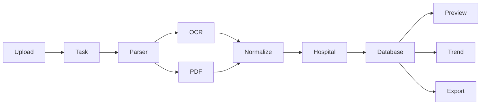

整个系统以 Parser 为核心。

OCR、PDF、Hospital、Normalize 全部围绕 Parser 工作。

---

# 3.7 数据流设计

整个数据流如下：

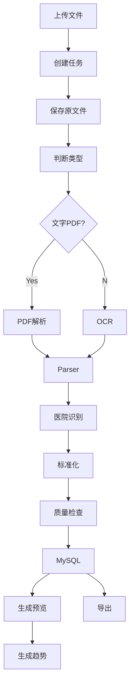

数据始终保持单向流动。

避免循环依赖。

---

# 3.8 核心处理流程

每份报告解析流程如下：

```
Report

↓

Page

↓

OCR/PDF

↓

Parser

↓

Hospital

↓

Normalize

↓

Validate

↓

Database

↓

Preview

↓

Trend
```

每一步均记录：

- 开始时间
- 完成时间
- 耗时
- 状态
- 日志

便于问题排查。

---

# 3.9 解析流水线（Pipeline）设计

解析采用流水线模式。

```text
Input File
    │
    ▼
File Detector
    │
    ▼
PDF/Image Loader
    │
    ▼
OCR Engine（如需要）
    │
    ▼
Hospital Detector
    │
    ▼
Parser
    │
    ▼
Normalizer
    │
    ▼
Validator
    │
    ▼
Persistence
    │
    ▼
Preview Generator
    │
    ▼
Export / Trend
```

每个节点均可独立替换、独立测试、独立扩展。

---

# 3.10 本章小结

本章完成了系统总体架构设计，定义了系统的分层结构、核心模块、数据流、目录结构及解析流水线，为后续技术选型及各模块详细设计奠定基础。

---

# 第四章 技术选型

## 4.1 概述

技术选型遵循以下原则：

- 开源成熟
- 长期维护
- 社区活跃
- 易于扩展
- 跨平台
- 性能稳定
- 适合前后端分离架构

下一节将详细介绍各技术组件的选择依据及对比分析。
````
````markdown id="4w8kq7"
# 4.2 技术架构总览

LabReportParser V3.0 采用当前主流的前后端分离技术体系。

整体技术栈如下：

| 层级 | 技术 |
|------|------|
| 前端 | Vue3 + TypeScript + Vite + Element Plus |
| Web Server | Nginx |
| 后端 | FastAPI |
| ORM | SQLAlchemy 2.x |
| 数据校验 | Pydantic v2 |
| 数据库 | MySQL 8.0 |
| OCR | PaddleOCR |
| PDF解析 | PyMuPDF + pdfplumber |
| 图片处理 | OpenCV |
| 异步任务 | Celery |
| 消息队列 | Redis |
| 文件预览 | PDF.js |
| 图表 | ECharts |
| 日志 | Loguru |
| 配置 | YAML |
| 容器 | Docker Compose |
| API文档 | OpenAPI + Swagger |

---

# 4.3 Python 技术选型

推荐版本：

```
Python 3.12
```

最低支持：

```
Python 3.11
```

推荐原因：

- 性能提升
- asyncio 更完善
- SQLAlchemy 完整支持
- FastAPI 官方推荐
- PaddleOCR 已兼容

禁止使用：

```
Python 3.8
Python 3.9
```

原因：

生命周期较短，不利于长期维护。

---

# 4.4 Web 框架选型

候选方案：

| 框架 | 是否采用 |
|------|----------|
| Django | × |
| Flask | × |
| Tornado | × |
| FastAPI | √ |

## FastAPI 选择原因

### 高性能

基于：

```
ASGI
```

异步处理能力优秀。

---

### 自动生成 OpenAPI

访问：

```
/docs
```

即可查看接口文档。

无需额外开发。

---

### 类型检查

结合：

Pydantic。

自动校验：

请求参数。

响应数据。

减少大量 Bug。

---

### 社区成熟

拥有：

- 丰富插件
- 完整生态
- 长期维护

---

# 4.5 ORM 选型

采用：

```
SQLAlchemy 2.x
```

原因：

支持：

MySQL

PostgreSQL

Oracle

SQLite

SQL Server

便于以后迁移数据库。

---

不采用：

```
Django ORM
```

原因：

依赖 Django。

---

# 4.6 数据库选型

采用：

```
MySQL 8.0
```

数据库账号：

```
root
```

密码：

```
root
```

（开发环境默认配置，生产环境必须修改。）

---

选择原因：

支持：

事务。

JSON。

索引。

全文检索。

窗口函数。

稳定成熟。

---

字符集：

```
utf8mb4
```

排序规则：

```
utf8mb4_general_ci
```

时区：

```
Asia/Shanghai
```

---

# 4.7 OCR 技术选型

采用：

```
PaddleOCR
```

主要原因：

支持：

中文。

英文。

数字。

医学报告。

支持：

CPU。

GPU。

Windows。

Linux。

Docker。

---

支持：

文字方向识别。

表格识别。

文本检测。

OCR。

后续支持：

PP-Structure。

---

OCR 输出：

```json
{
  "text":"ALT",
  "score":0.998,
  "bbox":[120,350,180,372]
}
```

全部保存数据库。

---

# 4.8 PDF 解析技术

采用：

双引擎。

```
PyMuPDF
```

+

```
pdfplumber
```

工作流程：

```
PDF

↓

PyMuPDF

↓

是否文字PDF？

↓

Yes

↓

pdfplumber

↓

Parser

↓

No

↓

OCR
```

---

采用双引擎原因：

PyMuPDF：

速度快。

pdfplumber：

表格提取效果更好。

两者互补。

---

# 4.9 图片处理技术

采用：

```
OpenCV
```

负责：

图片增强。

旋转。

去噪。

锐化。

二值化。

自动裁边。

倾斜校正。

---

以后：

支持：

深度学习增强。

---

# 4.10 前端技术

采用：

Vue3。

---

语言：

TypeScript。

---

构建：

Vite。

---

UI：

Element Plus。

---

状态管理：

Pinia。

---

路由：

Vue Router。

---

HTTP：

Axios。

---

图表：

ECharts。

---

PDF：

PDF.js。

---

图片：

Viewer.js。

---

# 4.11 文件存储设计

采用：

本地文件。

数据库：

仅保存：

路径。

不保存：

PDF二进制。

推荐目录：

```text
storage/

    upload/

    pdf/

    image/

    preview/

    thumbnail/

    ocr/

    export/

    temp/
```

所有目录：

自动创建。

---

# 4.12 Redis 选型

Redis：

负责：

任务。

缓存。

OCR缓存。

Session。

Celery。

---

缓存内容：

```
OCR

Hospital

Normalize

Config
```

提高性能。

---

# 4.13 Celery 选型

负责：

异步：

OCR。

批量解析。

导出。

趋势计算。

避免：

阻塞：

API。

---

任务状态：

```
Waiting

Running

Success

Failed

Retry
```

全部可查询。

---

# 4.14 Docker 部署

采用：

Docker Compose。

包括：

```
MySQL

Redis

Backend

Frontend

Nginx
```

一键启动。

命令：

```bash
docker compose up -d
```

即可完成部署。

---

# 4.15 日志框架

采用：

```
Loguru
```

日志等级：

```
DEBUG

INFO

WARNING

ERROR

CRITICAL
```

支持：

每天：

自动切割。

自动压缩。

自动删除。

---

日志分类：

```
system.log

ocr.log

parser.log

sql.log

api.log

error.log
```

---

# 4.16 配置管理

所有配置采用：

```
config.yaml
```

例如：

```yaml
server:
  host: 0.0.0.0
  port: 8000

mysql:
  host: localhost
  port: 3306
  user: root
  password: root
  database: lab_report

redis:
  host: localhost
  port: 6379
```

禁止：

配置：

写入：

Python代码。

---

# 4.17 技术选型总结

| 模块 | 技术方案 |
|------|----------|
| 后端 | FastAPI |
| ORM | SQLAlchemy 2.x |
| 数据库 | MySQL 8.0 |
| OCR | PaddleOCR |
| PDF | PyMuPDF + pdfplumber |
| 图片 | OpenCV |
| 缓存 | Redis |
| 异步任务 | Celery |
| 前端 | Vue3 + TS |
| UI | Element Plus |
| 图表 | ECharts |
| PDF预览 | PDF.js |
| 文件存储 | 本地文件系统 |
| 容器 | Docker Compose |
| 日志 | Loguru |

以上技术均为成熟开源方案，满足长期维护、可扩展及企业级部署需求。

---

# 第五章 系统模块设计

## 5.1 概述

系统采用模块化设计，各模块之间通过接口解耦。每个模块拥有独立职责、独立配置和独立测试能力。

本章将详细说明各核心模块的职责、接口、数据流及内部实现，包括上传中心、任务管理、OCR 引擎、PDF 解析、医院识别、标准化、预览、导出、趋势分析等模块。
````
# 5.2 模块划分

系统按照领域驱动（DDD）思想进行模块划分。

```
LabReportParser
│
├── Upload（上传中心）
├── Task（任务中心）
├── File（文件管理）
├── OCR（OCR识别）
├── PDF（PDF解析）
├── Parser（报告解析）
├── Hospital（医院识别）
├── Normalize（标准化）
├── Validate（数据校验）
├── Preview（在线预览）
├── Export（数据导出）
├── Trend（趋势分析）
├── User（用户管理）
├── System（系统管理）
├── Audit（审计日志）
└── Monitor（系统监控）
```

模块之间全部通过 Service 接口通信。

禁止跨模块直接访问数据库。

---

# 5.3 模块关系图

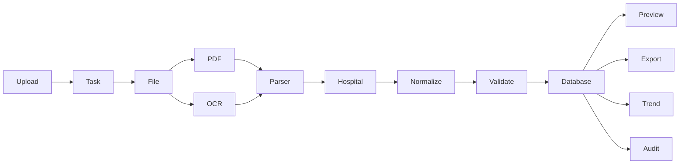

数据库始终作为中心数据源。

所有查询均来源于数据库。

---

# 5.4 Upload 模块

## 5.4.1 职责

负责：

- 上传目录
- 上传多个文件
- 上传单文件
- 文件校验
- 创建解析任务
- 保存原始文件
- 文件去重

---

## 5.4.2 输入

支持：

```
PDF

PNG

JPG

JPEG

BMP

TIFF

WEBP
```

---

支持：

```
整个目录
```

例如：

```
D:\private\CS\CS\LabReport
```

递归扫描：

所有子目录。

---

## 5.4.3 输出

输出：

```
UploadTask
```

包括：

```
TaskID

文件数量

状态

开始时间
```

---

## 5.4.4 工作流程

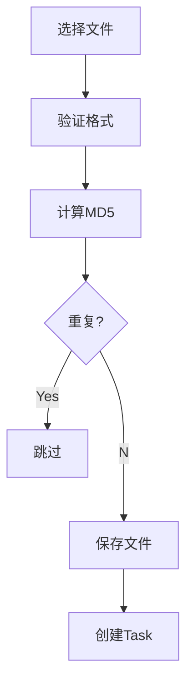

---

# 5.5 Task 模块

任务模块负责：

整个解析生命周期。

---

## 生命周期

```
Created

↓

Waiting

↓

Running

↓

Finished
```

异常：

```
Running

↓

Failed

↓

Retry

↓

Finished
```

---

## Task 字段

| 字段 | 说明 |
|------|------|
| id | 任务ID |
| task_name | 名称 |
| status | 状态 |
| total_files | 总文件数 |
| success_files | 成功数 |
| failed_files | 失败数 |
| progress | 百分比 |
| create_time | 创建时间 |
| finish_time | 完成时间 |

---

支持：

暂停。

恢复。

取消。

重新执行。

---

# 5.6 File 模块

负责：

统一文件管理。

包括：

```
上传

保存

读取

删除

移动

缩略图
```

---

## 推荐目录

```text
storage/

    upload/

        original/

        image/

        pdf/

        thumbnail/

        preview/

        temp/

        export/

        cache/
```

---

数据库：

仅保存：

路径。

例如：

```
storage/upload/original/2026/07/001.pdf
```

避免：

数据库：

存储：

Blob。

---

## 文件命名规则

推荐：

UUID。

例如：

```
4db2f65b.pdf
```

数据库保存：

```
原文件名

UUID

MD5

SHA256
```

支持：

重复文件判断。

---

# 5.7 OCR 模块

OCR：

整个系统最重要模块。

---

## 输入

图片。

扫描PDF。

---

## 输出

OCRBlock。

例如：

```json
{
  "page":1,
  "text":"ALT",
  "score":0.998,
  "bbox":[120,320,180,340]
}
```

---

## OCR流程

```
图片

↓

OpenCV

↓

增强

↓

PaddleOCR

↓

OCR JSON

↓

Parser
```

---

## OCR增强

支持：

自动：

去噪。

锐化。

灰度。

二值化。

旋转。

裁边。

倾斜校正。

提高：

OCR成功率。

---

## OCR缓存

第一次：

OCR。

保存：

JSON。

第二次：

直接：

读取缓存。

避免：

重复OCR。

---

# 5.8 PDF 模块

负责：

PDF。

---

判断：

```
是否文字PDF？
```

---

流程：

```
PDF

↓

PyMuPDF

↓

Text?

↓

Yes

↓

pdfplumber

↓

Parser

↓

No

↓

Image

↓

OCR
```

---

支持：

混合PDF。

例如：

第一页：

文字。

第二页：

扫描。

系统自动判断。

---

支持：

1000页。

自动分页。

---

# 5.9 Parser 模块

Parser：

负责：

真正：

解析：

字段。

例如：

```
ALT

35

U/L

9~50

↑
```

转换：

统一：

对象。

---

输出：

```python
LabResult(
    item_name="谷丙转氨酶",
    abbreviation="ALT",
    result="35",
    unit="U/L",
    reference_low=9,
    reference_high=50,
    abnormal_flag="N"
)
```

---

Parser：

分层：

```
BaseParser

↓

HospitalParser

↓

CommonParser
```

医院：

Parser：

继承：

BaseParser。

---

# 5.10 Hospital 模块

负责：

自动识别医院。

---

识别依据：

```
Logo

医院名称

地址

电话

页眉

模板
```

综合评分。

---

例如：

```
北京协和医院
```

立即：

```
Parser=

PekingUnionParser
```

---

支持：

后台：

新增：

医院模板。

无需：

修改：

Python。

---

# 5.11 Normalize 模块

负责：

统一：

```
项目

单位

参考范围

异常

日期
```

---

例如：

```
GPT

↓

ALT
```

```
谷丙转氨酶

↓

ALT
```

单位：

```
IU/L

↓

U/L
```

异常：

```
↑

↓

H
```

---

Normalize：

不修改：

原始数据。

新增：

标准数据。

两者：

同时保存。

---

# 5.12 Validate 模块

负责：

数据质量检查。

检查：

```
结果为空？

单位为空？

日期为空？

参考范围错误？

异常标记错误？
```

全部：

检查。

---

发现：

异常。

进入：

```
Review Queue
```

等待：

人工处理。

---

# 5.13 Preview 模块

负责：

在线预览：

PDF。

图片。

---

支持：

- PDF.js 在线浏览
- 图片浏览
- OCR 文本高亮
- Bounding Box 高亮
- 鼠标点击定位
- 页面缩放
- 多页切换
- 缩略图导航

---

用户点击：

```
ALT
```

系统：

自动：

定位：

PDF：

对应：

Bounding Box。

实现：

"数据→原始报告"

双向追溯。

---

（Volume 1 继续，下一部分将完成第 5 章剩余模块：Export、Trend、User、System、Audit、Monitor，并进入第 6 章 OCR 引擎详细设计。）
````markdown id="62815"
# 5.14 Export 模块

## 5.14.1 模块职责

Export 模块负责系统所有数据导出功能。

支持：

- Excel（.xlsx）
- CSV（UTF-8 BOM）
- JSON（预留）
- XML（预留）
- FHIR（V4.0规划）

导出数据均来源于 MySQL，不直接读取 PDF 或 OCR 文件。

---

## 5.14.2 导出内容

支持导出：

### 检验结果

| 字段 |
|------|
| 医院名称 |
| 采样日期 |
| 报告日期 |
| 标准项目名称 |
| 项目缩写 |
| 原始项目名称 |
| 检验结果 |
| 单位 |
| 参考范围 |
| 异常标记 |
| 来源文件 |
| 页码 |

---

### OCR 数据

支持导出：

- OCR 文本
- OCR 坐标
- OCR 置信度

方便人工校对。

---

### 解析日志

包括：

- 解析耗时
- OCR耗时
- Parser耗时
- 标准化耗时
- 导入时间
- 错误信息

---

## 5.14.3 Excel 导出规范

推荐使用：

```
openpyxl
```

一个工作簿建议包含多个 Sheet。

```
Workbook
│
├── 检验结果
├── 原始OCR
├── 报告信息
├── 错误日志
└── 数据统计
```

---

Excel 自动格式化：

- 冻结首行
- 自动筛选
- 自动列宽
- 日期格式统一
- 异常值高亮（条件格式）

---

## 5.14.4 CSV 导出规范

编码：

```
UTF-8 BOM
```

分隔符：

```
,
```

日期统一格式：

```
YYYY-MM-DD HH:mm:ss
```

空值：

```
NULL
```

---

# 5.15 Trend 模块

## 5.15.1 模块职责

Trend 模块负责：

医学检验结果历史趋势分析。

---

支持：

- 时间趋势
- 最大值
- 最小值
- 平均值
- 中位数
- 波动范围
- 异常统计

---

## 5.15.2 趋势对象

例如：

ALT

历史：

```
2021

↓

18

2022

↓

25

2023

↓

32

2024

↓

29
```

自动：

生成：

折线图。

---

## 5.15.3 支持指标

包括：

肝功能：

```
ALT

AST

ALP

GGT

TBIL
```

肾功能：

```
CREA

BUN

UA
```

血脂：

```
TC

TG

HDL

LDL
```

糖尿病：

```
GLU

HbA1c
```

肿瘤标志物：

```
AFP

CEA

CA125

CA199

PSA
```

血常规：

全部支持。

---

## 5.15.4 图表

采用：

```
ECharts
```

支持：

折线图。

柱状图。

面积图。

雷达图（预留）。

---

支持：

导出：

PNG。

SVG。

PDF。

---

# 5.16 User 模块

负责：

用户管理。

---

包括：

```
登录

退出

修改密码

角色

权限
```

---

采用：

JWT。

登录：

成功：

返回：

```
Access Token

Refresh Token
```

---

角色：

```
Admin

Doctor

User

Viewer
```

RBAC：

权限控制。

---

# 5.17 System 模块

负责：

系统配置。

包括：

医院模板。

标准指标。

单位。

日志。

线程。

OCR。

Redis。

数据库。

---

后台：

全部：

可配置。

无需：

修改代码。

---

配置：

自动：

热加载。

无需：

重启。

---

# 5.18 Audit 模块

负责：

审计日志。

记录：

所有：

数据修改。

例如：

```
ALT

35

↓

38
```

记录：

修改前。

修改后。

修改人。

修改时间。

IP。

浏览器。

原因。

---

支持：

历史版本。

恢复。

比较。

---

# 5.19 Monitor 模块

负责：

系统监控。

包括：

CPU。

内存。

Redis。

MySQL。

OCR。

任务。

线程。

API。

---

支持：

Dashboard。

实时刷新。

---

告警：

支持：

邮件（预留）。

企业微信（预留）。

钉钉（预留）。

Webhook（预留）。

---

# 5.20 模块依赖关系

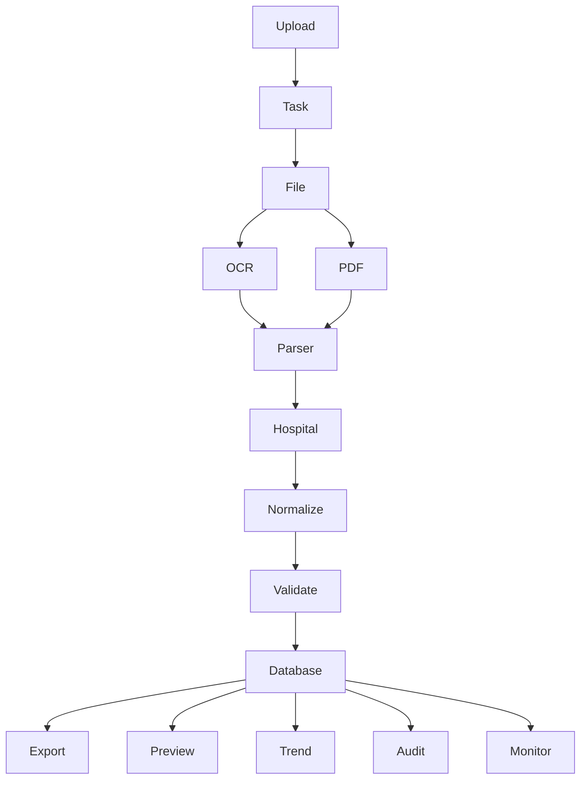

所有业务最终汇聚至数据库。

数据库是唯一可信数据源（Single Source of Truth）。

---

# 5.21 本章总结

本章完成了系统所有核心业务模块的设计，定义了模块职责、输入输出、工作流程及依赖关系。

系统采用插件化、模块化设计，具备良好的扩展能力和维护性。

---

# 第六章 OCR 引擎详细设计

## 6.1 概述

OCR（Optical Character Recognition）是 LabReportParser 的核心能力之一。

系统必须能够自动识别：

- 扫描版 PDF
- 图片格式检验报告
- 手机拍照
- 彩色扫描件
- 黑白扫描件
- 多页文档

OCR 识别结果将作为 Parser 的主要输入数据。

---

# 6.2 OCR 总体架构

OCR 模块采用流水线处理模式。


整个 OCR 过程由多个独立阶段组成，各阶段均可单独优化或替换。

---

# 6.3 OCR 输入

支持以下输入格式：

| 类型 | 支持 |
|------|------|
| JPG | √ |
| JPEG | √ |
| PNG | √ |
| BMP | √ |
| TIFF | √ |
| WEBP | √ |
| PDF（扫描） | √ |
| PDF（文字） | 自动跳过 OCR |

对于 PDF 文件，系统首先判断是否包含可提取文本。

若为文字版 PDF，则直接进入 PDF 解析模块。

若为扫描版 PDF，则先转换为图片，再进入 OCR 流程。

---

# 6.4 图片预处理

为了提高 OCR 识别率，OCR 前统一执行图像预处理。

处理步骤如下：

1. 自动读取图片
2. 检测图片方向
3. 自动旋转至正向
4. 灰度化
5. 去噪
6. 锐化
7. 自适应二值化
8. 倾斜校正
9. 裁剪白边
10. 输出标准图片

预处理后的图片仅用于 OCR，不覆盖原始图片。

原始文件始终保留，用于审计和在线预览。

---

# 6.5 图片增强策略

根据不同图片质量，采用不同增强策略。

| 图片类型 | 处理策略 |
|----------|----------|
| 手机拍照 | 去透视、降噪、旋转 |
| 扫描 PDF | 锐化、二值化 |
| 彩色图片 | 灰度化、对比度增强 |
| 黑白扫描 | 去噪、锐化 |
| 模糊图片 | 超分辨率（V4.0 规划） |

增强策略由配置文件控制，可根据医院模板单独调整。

---

（Volume 1 未完，下一部分继续第 6 章：OCR 引擎内部设计、Bounding Box、缓存机制、多线程 OCR、异常处理及性能优化。）```
````


````markdown id="74291"
# 6.6 OCR 引擎内部设计

## 6.6.1 模块组成

OCR 模块内部划分为多个独立组件。

```text
OCRService
│
├── ImageLoader
├── ImagePreprocessor
├── OrientationDetector
├── OCRAdapter
├── OCRPostProcessor
├── OCRCache
├── OCRValidator
└── OCRExporter
```

各组件职责如下：

| 模块 | 职责 |
|------|------|
| ImageLoader | 加载图片/PDF页面 |
| ImagePreprocessor | 图像增强 |
| OrientationDetector | 自动检测方向 |
| OCRAdapter | 调用 PaddleOCR |
| OCRPostProcessor | 清洗 OCR 结果 |
| OCRCache | OCR 结果缓存 |
| OCRValidator | OCR 数据校验 |
| OCRExporter | 输出统一数据结构 |

所有组件均通过接口解耦，方便后续替换 OCR 引擎。

---

# 6.7 OCRService 类设计

```text
OCRService
│
├── recognize_image()
├── recognize_pdf_page()
├── recognize_batch()
├── preprocess()
├── load_cache()
├── save_cache()
├── validate_result()
└── export_result()
```

主要职责：

- 对外提供统一 OCR 接口
- 调用图像预处理
- 调用 PaddleOCR
- 管理缓存
- 输出统一 OCRBlock

---

# 6.8 OCRAdapter 设计

采用适配器模式（Adapter Pattern）。

```text
BaseOCRAdapter
        ▲
        │
        ├── PaddleOCRAdapter
        ├── EasyOCRAdapter（预留）
        ├── TesseractAdapter（预留）
        └── CloudOCRAdapter（预留）
```

业务层始终依赖：

```
BaseOCRAdapter
```

而不直接依赖具体 OCR 实现。

这样后续更换 OCR 引擎时，无需修改业务逻辑。

---

# 6.9 OCR 输出数据模型

OCR 每识别一块文本，生成一个 OCRBlock。

```json
{
  "page": 1,
  "block_index": 15,
  "text": "ALT",
  "confidence": 0.9987,
  "bbox": {
    "x": 128,
    "y": 342,
    "width": 62,
    "height": 21
  },
  "rotation": 0,
  "language": "zh"
}
```

字段说明：

| 字段 | 说明 |
|------|------|
| page | 页码 |
| block_index | 块序号 |
| text | OCR 文本 |
| confidence | 识别置信度 |
| bbox | Bounding Box |
| rotation | 文本方向 |
| language | 识别语言 |

---

# 6.10 Bounding Box 设计

Bounding Box 是实现：

> 点击指标定位原始化验单

功能的核心。

统一采用矩形坐标。

```text
┌──────────────────────────────┐
│                              │
│      ALT      35 U/L         │
│                              │
└──────────────────────────────┘

Bounding Box：

x

y

width

height
```

数据库保存：

```
page_no

x

y

width

height
```

前端直接读取坐标。

无需重新 OCR。

---

## Bounding Box 使用场景

### 在线预览

点击：

```
ALT
```

↓

自动滚动：

PDF。

↓

高亮：

ALT。

---

### OCR 调试

开发人员：

查看：

OCR：

识别区域。

---

### 人工校对

用户点击：

OCR。

立即定位：

图片。

---

### AI训练（预留）

Bounding Box：

可作为：

目标检测。

版面分析。

训练数据。

---

# 6.11 OCR 后处理

OCR 完成后执行统一清洗。

包括：

---

## 去空白

例如：

```
 ALT
```

↓

```
ALT
```

---

## 去换行

```
谷丙

转氨酶
```

↓

```
谷丙转氨酶
```

---

## 去重复字符

例如：

```
11111
```

↓

```
1111
```

（按配置处理）

---

## OCR 常见错误修正

例如：

```
O

↓

0
```

```
I

↓

1
```

```
l

↓

1
```

```
S

↓

5
```

修正规则：

来自：

```
ocr_replace.yaml
```

支持：

医院：

单独配置。

---

# 6.12 OCR 缓存设计

OCR 是最耗时模块。

采用：

缓存。

避免重复识别。

---

缓存键：

```
SHA256(图片)
```

缓存值：

OCR JSON。

例如：

```
storage/cache/ocr/

ab/

abcd1234.json
```

数据库：

保存：

缓存路径。

---

流程：

```
图片

↓

SHA256

↓

缓存存在？

↓

YES

↓

直接读取

↓

NO

↓

OCR

↓

保存缓存
```

缓存命中率：

预计：

90%以上。

---

# 6.13 多线程 OCR

支持：

ThreadPool。

例如：

```
Page1

Page2

Page3

Page4
```

同时：

OCR。

提高：

速度。

---

推荐：

线程数：

```
CPU × 2
```

例如：

8核。

线程：

16。

可配置。

---

# 6.14 OCR 异常处理

支持：

异常分类。

| 异常 | 处理方式 |
|------|----------|
| 图片损坏 | 标记失败 |
| OCR超时 | 自动重试 |
| PaddleOCR异常 | 记录日志 |
| 内存不足 | 降低并发 |
| 页面为空 | 跳过 |
| 图片过大 | 自动缩放 |

异常不会导致整个任务中断。

单页失败，不影响其他页面解析。

---

# 6.15 OCR 日志设计

记录：

```
开始时间

结束时间

OCR耗时

图片大小

页码

OCR数量

平均置信度

异常
```

日志示例：

```text
[OCR]
File: report001.pdf
Page: 2
Blocks: 156
AvgConfidence: 0.992
Cost: 0.83s
Status: Success
```

---

# 6.16 OCR 性能优化

采用以下优化策略：

### 1. OCR 缓存

避免重复识别。

---

### 2. 图片缩放

超大图片：

先缩放。

再 OCR。

---

### 3. 多线程

多页：

并行 OCR。

---

### 4. GPU（可选）

检测：

CUDA。

自动：

GPU。

否则：

CPU。

---

### 5. Lazy OCR

文字 PDF：

不 OCR。

直接：

解析。

---

### 6. 批量任务队列

Celery：

后台：

异步：

OCR。

API：

立即返回。

---

# 6.17 OCR 配置文件

推荐：

```yaml
ocr:

  engine: paddle

  language: chinese

  use_gpu: false

  thread_num: 16

  enable_cache: true

  confidence_threshold: 0.85

  auto_rotate: true

  auto_deskew: true

  auto_denoise: true

  save_json: true

  save_image: false
```

所有参数：

后台：

可修改。

无需：

重新部署。

---

# 6.18 OCR 流程时序图

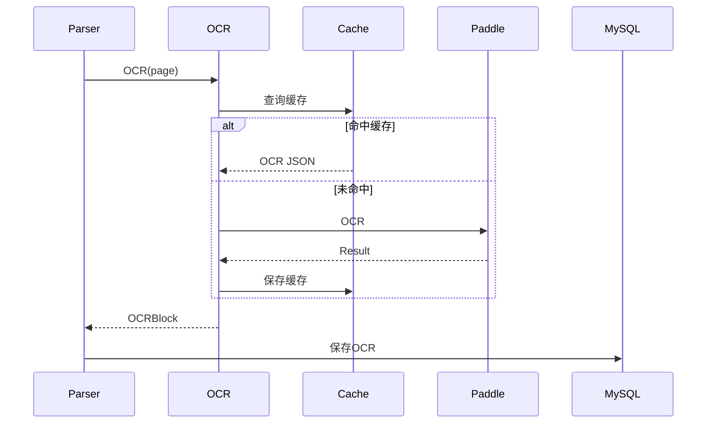

---

# 6.19 本章总结

本章详细设计了 OCR 引擎，包括架构、数据模型、Bounding Box、缓存、多线程、异常处理、配置管理及性能优化方案。

OCR 模块作为整个系统的数据入口，为 PDF 解析、医院识别和标准化提供统一、可靠的数据基础。

---

# 第七章 PDF 解析详细设计

## 7.1 概述

PDF 解析模块负责识别和处理所有 PDF 格式的检验报告。

系统能够自动区分：

- 文字版 PDF
- 扫描版 PDF
- 混合型 PDF

并根据页面类型自动选择最优解析路径，无需用户手工指定。

```
````
````markdown id="86314"
# 7.2 PDF 解析总体架构

PDF 解析模块采用分层设计。

```text
PDFService
│
├── PDFLoader
├── PDFAnalyzer
├── TextExtractor
├── ImageExtractor
├── PageClassifier
├── PDFRenderer
├── PDFCache
└── PDFExporter
```

各模块职责如下：

| 模块 | 职责 |
|------|------|
| PDFLoader | 加载 PDF 文件 |
| PDFAnalyzer | 分析 PDF 结构 |
| TextExtractor | 提取文本 |
| ImageExtractor | 提取图片 |
| PageClassifier | 判断页面类型 |
| PDFRenderer | PDF 转图片 |
| PDFCache | PDF 页面缓存 |
| PDFExporter | 输出统一 Page 数据 |

---

# 7.3 PDF 分类

系统自动识别三种 PDF。

---

## 类型一：文字版 PDF

特点：

- 可复制文字
- 可搜索
- 文件较小
- 无需 OCR

流程：

```
PDF

↓

Text Extractor

↓

Parser
```

解析速度最快。

---

## 类型二：扫描版 PDF

特点：

- 整页图片
- 无法复制文字
- 需要 OCR

流程：

```
PDF

↓

Render Image

↓

OCR

↓

Parser
```

---

## 类型三：混合 PDF

特点：

例如：

第一页：

文字。

第二页：

扫描。

第三页：

文字。

系统自动：

逐页判断。

无需用户选择。

---

# 7.4 PDFService 设计

统一接口：

```text
PDFService
│
├── open()
├── analyze()
├── classify_page()
├── extract_text()
├── render_image()
├── export_page()
├── load_cache()
└── save_cache()
```

业务模块仅调用：

```text
PDFService
```

不直接依赖：

PyMuPDF。

---

# 7.5 PDF 页面分析

每一页生成：

```text
PageInfo
```

例如：

```json
{
  "page":1,
  "width":2480,
  "height":3508,
  "text_count":326,
  "image_count":1,
  "page_type":"TEXT"
}
```

字段：

| 字段 | 说明 |
|------|------|
| page | 页码 |
| width | 宽 |
| height | 高 |
| text_count | 文本数量 |
| image_count | 图片数量 |
| page_type | 页面类型 |

---

# 7.6 页面类型识别算法

采用评分机制。

```
Score =

文字数量

+

图片面积比例

+

字体数量

+

对象数量
```

例如：

```
Text > 100

↓

TEXT PDF
```

```
Text < 10

↓

IMAGE PDF
```

```
其它

↓

MIXED
```

避免：

误判。

---

# 7.7 PDF 转图片

扫描 PDF：

全部：

Render。

采用：

PyMuPDF。

推荐：

300 DPI。

配置：

```yaml
pdf:

  render_dpi: 300

  image_format: png

  cache: true
```

输出：

```
storage/

    preview/

        report001/

            page001.png

            page002.png
```

用于：

OCR。

预览。

缩略图。

---

# 7.8 PDF 文本提取

采用：

```
pdfplumber
```

读取：

文本。

表格。

字体。

位置。

例如：

```json
{
  "text":"ALT",
  "x":120,
  "y":335,
  "font":"Arial",
  "size":10
}
```

Parser：

直接：

使用。

无需 OCR。

---

# 7.9 PDF 图片提取

部分医院：

Logo。

二维码。

图片。

采用：

PyMuPDF。

提取：

全部图片。

保存：

```
storage/image/
```

以后：

用于：

医院识别。

AI。

---

# 7.10 PDF 页面缓存

每页：

Render。

缓存。

目录：

```
storage/cache/pdf/
```

缓存键：

```
SHA256(PDF)

+

Page
```

避免：

重复：

Render。

---

# 7.11 PDF 多线程解析

支持：

多页：

并发。

例如：

```
Page1

Page2

Page3

Page4
```

同时：

解析。

提高：

速度。

推荐：

线程：

```
CPU × 2
```

---

# 7.12 PDF 异常处理

异常：

| 异常 | 处理 |
|------|------|
| PDF损坏 | 标记失败 |
| 密码保护 | 提示用户 |
| 页面为空 | 跳过 |
| 字体损坏 | OCR回退 |
| Render失败 | 重试 |
| 超大PDF | 分页解析 |

异常：

记录：

日志。

不中断：

整个任务。

---

# 7.13 PDF 日志

记录：

```
PDF加载

页数

Render耗时

Text耗时

OCR耗时

Parser耗时
```

示例：

```text
[PDF]

report001.pdf

Pages:4

TextPage:3

ImagePage:1

Render:0.32s

Status:Success
```

---

# 7.14 PDF 性能优化

采用：

### Lazy Render

仅：

扫描页：

Render。

---

### Render Cache

缓存：

PNG。

避免：

重复：

Render。

---

### 并行解析

多页：

同时。

---

### OCR 跳过

文字页：

不 OCR。

---

### 内存回收

每页：

结束。

立即：

释放。

避免：

OOM。

---

# 7.15 PDF 输出模型

统一：

输出：

```text
PDFPage
```

字段：

| 字段 | 说明 |
|------|------|
| report_id | 所属报告 |
| page_no | 页码 |
| page_type | TEXT/IMAGE/MIXED |
| width | 宽 |
| height | 高 |
| image_path | PNG路径 |
| thumbnail | 缩略图 |
| text_count | 文本数 |
| ocr_status | OCR状态 |

供：

Parser。

Preview。

共同使用。

---

# 7.16 PDF 与 OCR 协同流程

```mermaid
flowchart TD

PDF

↓

Page Analyze

↓

TEXT?

↓

Yes

↓

Text Extract

↓

Parser

↓

No

↓

Render PNG

↓

OCR

↓

Parser
```

统一：

Parser。

无需关心：

来源。

---

# 7.17 本章总结

本章完成了 PDF 解析模块详细设计，包括页面分类、文本提取、图片渲染、缓存、多线程、异常处理及性能优化，为系统统一解析各类 PDF 报告提供了可靠基础。

---

# 第八章 医院识别与解析引擎设计

## 8.1 概述

医院识别模块负责自动识别化验单所属医院，并动态选择对应的解析模板（Parser）。

由于不同医院在报告版式、项目名称、表格布局及字段命名上存在较大差异，系统采用“医院识别 + 插件化解析器”的设计方案，实现自动适配不同医院格式，同时保证后续新增医院时无需修改核心代码。

本章将详细介绍医院识别算法、模板管理、Parser 插件机制及扩展设计。
````
````markdown id="90152"
# 8.2 医院识别总体架构

医院识别模块位于 Parser 之前。

整体流程如下：


识别完成后，系统自动实例化对应的 Parser。

整个过程无需人工干预。

---

# 8.3 Hospital 模块组成

```text
Hospital
│
├── HospitalDetector
├── HospitalRepository
├── HospitalFactory
├── HospitalParserManager
├── CommonParser
├── BaseParser
└── HospitalPlugins
```

职责如下：

| 模块 | 职责 |
|------|------|
| HospitalDetector | 自动识别医院 |
| HospitalRepository | 医院信息管理 |
| HospitalFactory | 创建 Parser |
| ParserManager | 管理 Parser 生命周期 |
| BaseParser | Parser 基类 |
| CommonParser | 通用解析器 |
| HospitalPlugins | 各医院插件 |

---

# 8.4 医院识别流程

医院识别采用多特征融合算法。

```mermaid
flowchart TD

OCR/Text

↓

医院名称

↓

Logo

↓

电话

↓

地址

↓

页眉

↓

模板特征

↓

综合评分

↓

Hospital
```

任何一个特征均可参与识别。

最终根据综合得分确定医院。

---

# 8.5 医院识别策略

采用多级匹配。

## 一级匹配：医院名称

例如：

```
北京协和医院
```

直接匹配：

```
北京协和医院
```

识别准确率最高。

---

## 二级匹配：Logo

例如：

Logo：

```
PUMCH
```

即可识别：

北京协和医院。

Logo 可采用：

OCR。

图片 Hash。

模板匹配。

---

## 三级匹配：地址

例如：

```
北京市东城区帅府园1号
```

即可判断：

协和医院。

---

## 四级匹配：电话

例如：

```
010-69156114
```

医院唯一。

---

## 五级匹配：页眉

例如：

```
临床检验报告单
```

结合：

字体。

布局。

页眉。

进行识别。

---

## 六级匹配：模板特征

例如：

ALT：

位于：

```
第4列
```

医院：

固定。

模板：

固定。

自动识别。

---

# 8.6 HospitalDetector 类设计

统一接口：

```text
HospitalDetector

├── detect()

├── detect_by_name()

├── detect_by_logo()

├── detect_by_address()

├── detect_by_phone()

├── detect_by_layout()

└── calculate_score()
```

最终返回：

```json
{
    "hospital":"北京协和医院",
    "confidence":0.996
}
```

---

# 8.7 HospitalFactory 设计

采用：

Factory Pattern。

```text
HospitalFactory

↓

北京协和医院

↓

PekingUnionParser
```

例如：

```text
HospitalFactory

↓

上海瑞金医院

↓

RuijinParser
```

业务代码：

无需：

if...else。

---

# 8.8 BaseParser 设计

所有 Parser：

继承：

```text
BaseParser
```

统一接口：

```text
BaseParser

├── parse()

├── parse_header()

├── parse_items()

├── parse_footer()

├── validate()

└── export()
```

保证：

所有 Parser：

行为一致。

---

# 8.9 CommonParser

若：

医院：

无法识别。

采用：

```
CommonParser
```

特点：

基于：

规则。

OCR。

关键词。

自动解析。

成功率：

约：

80%～90%。

后续：

人工：

确认。

---

# 8.10 医院插件机制

推荐目录：

```text
plugins/

    hospital/

        peking_union/

            parser.py

            config.yaml

        ruijin/

            parser.py

            config.yaml

        west_china/

            parser.py

            config.yaml

        common/

            parser.py
```

新增医院：

仅新增：

目录。

无需修改：

核心代码。

---

# 8.11 Parser 生命周期

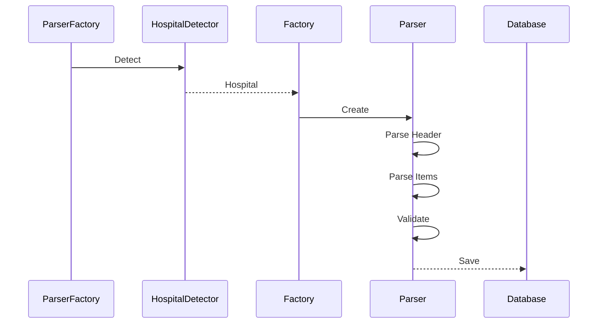

Parser：

创建后：

立即解析。

结束：

释放。

---

# 8.12 Parser 输出模型

统一输出：

```python
LabResult(
    hospital="北京协和医院",
    report_no="202607180001",
    sample_time="2026-07-18 08:30",
    item_name="谷丙转氨酶",
    abbreviation="ALT",
    result="35",
    unit="U/L",
    reference_low=9,
    reference_high=50,
    abnormal_flag="N",
    page_no=1,
    bbox=(120,340,182,362)
)
```

所有 Parser：

必须：

输出：

统一对象。

---

# 8.13 Parser 配置

每个医院：

拥有：

独立配置。

例如：

```yaml
hospital:

  name: 北京协和医院

  parser: PekingUnionParser

keywords:

  - 北京协和医院

  - PUMCH

header:

  report_title: 临床检验报告单

layout:

  table_start: 360

  column_count: 6
```

无需：

修改代码。

---

# 8.14 Parser 自动加载

系统启动：

自动扫描：

```text
plugins/hospital/
```

发现：

所有：

Parser。

自动：

注册。

例如：

```text
PekingUnionParser

↓

Register
```

```
RuijinParser

↓

Register
```

Factory：

自动：

可用。

---

# 8.15 Parser 热更新

后台：

新增：

医院。

上传：

Parser。

刷新：

无需：

重启。

支持：

热加载。

提高：

维护效率。

---

# 8.16 Parser 异常处理

支持：

| 异常 | 处理 |
|------|------|
| 医院未知 | CommonParser |
| Parser异常 | 自动重试 |
| 字段缺失 | 标记 Review |
| OCR失败 | 返回 OCR 阶段 |
| 配置错误 | 停止插件加载 |
| 模板版本冲突 | 使用最新版本 |

所有异常：

均记录：

日志。

---

# 8.17 医院模板版本管理

每个模板：

维护：

版本号。

例如：

```text
北京协和医院

v1.0

↓

v1.1

↓

v2.0
```

数据库保存：

| 字段 | 说明 |
|------|------|
| hospital_id | 医院ID |
| version | 模板版本 |
| release_date | 发布时间 |
| author | 维护人 |
| status | 是否启用 |

支持：

历史版本回滚。

---

# 8.18 Parser 单元测试

每个 Parser：

必须：

提供：

标准测试数据。

例如：

```text
tests/

    parser/

        test_peking_union.py

        test_ruijin.py

        test_common.py
```

覆盖：

Header。

Items。

Footer。

异常。

OCR。

保证：

Parser：

升级：

不影响：

已有医院。

---

# 8.19 医院识别性能

目标：

| 指标 | 目标 |
|------|------:|
| 医院识别率 | ≥99% |
| Parser加载 | ≤100ms |
| 单页识别 | ≤50ms |
| 新增医院 | 无需重启 |
| 模板热更新 | ≤5秒 |

---

# 8.20 本章总结

本章详细设计了医院识别与 Parser 插件体系，通过 HospitalDetector、Factory、BaseParser 和插件化医院模板，实现多医院自动识别、自动解析和热更新能力。

该设计确保系统能够在不修改核心程序的前提下持续扩展新的医院模板，并保持统一的数据输出格式。

---

# 第九章 数据标准化引擎设计

## 9.1 概述

数据标准化（Normalization）是 LabReportParser 的核心能力之一。

由于不同医院对同一检验项目存在不同命名方式、单位表示及参考范围格式，本模块负责将解析得到的原始数据统一转换为标准医学数据模型，同时保留原始值，保证数据可追溯、可统计、可分析。

本章将详细介绍标准化规则、字典管理、单位转换、异常标记统一及标准化流程。
````
````markdown id="10438"
# 9.2 标准化总体架构

标准化模块位于 Parser 之后，是所有检验数据入库前的最后一个业务处理模块。

总体架构如下：

```mermaid
flowchart LR

Parser

-->

Raw Result

-->

Normalizer

-->

Dictionary

-->

Unit Converter

-->

Reference Parser

-->

Validator

-->

LabResult

-->

MySQL
```

标准化后的数据统一进入数据库。

任何统计分析均基于标准化数据。

---

# 9.3 Normalize 模块组成

```text
Normalize
│
├── ItemNormalizer
├── UnitNormalizer
├── ReferenceNormalizer
├── FlagNormalizer
├── DateNormalizer
├── DictionaryManager
├── RuleEngine
└── Validator
```

模块职责：

| 模块 | 职责 |
|------|------|
| ItemNormalizer | 项目名称标准化 |
| UnitNormalizer | 单位统一 |
| ReferenceNormalizer | 参考范围解析 |
| FlagNormalizer | 异常标记统一 |
| DateNormalizer | 日期格式统一 |
| DictionaryManager | 标准字典 |
| RuleEngine | 标准化规则引擎 |
| Validator | 数据合法性检查 |

---

# 9.4 标准化流程

```mermaid
flowchart TD

Raw Result

↓

项目名称

↓

单位

↓

参考范围

↓

异常标记

↓

日期

↓

合法性检查

↓

保存数据库
```

每一步均可独立配置。

---

# 9.5 项目名称标准化

## 原则

所有医院：

统一采用：

国家医学检验标准名称。

例如：

| 原始名称 | 标准名称 | 缩写 |
|----------|----------|------|
| ALT | 谷丙转氨酶 | ALT |
| GPT | 谷丙转氨酶 | ALT |
| Alanine Aminotransferase | 谷丙转氨酶 | ALT |
| 谷丙 | 谷丙转氨酶 | ALT |

数据库保存：

```
raw_name

standard_name

abbreviation
```

原始名称永不覆盖。

---

# 9.6 项目标准字典

采用：

MySQL。

表：

```
lab_item_dictionary
```

主要字段：

| 字段 | 说明 |
|------|------|
| id | 主键 |
| standard_name | 标准名称 |
| abbreviation | 缩写 |
| english_name | 英文名称 |
| category | 分类 |
| aliases | 别名(JSON) |
| enable | 是否启用 |

例如：

```json
{
    "standard_name":"谷丙转氨酶",
    "abbreviation":"ALT",
    "aliases":[
        "GPT",
        "谷丙",
        "Alanine Aminotransferase"
    ]
}
```

---

# 9.7 单位标准化

不同医院：

单位不同。

例如：

```
IU/L
```

```
U/L
```

```
IU·L⁻¹
```

统一：

```
U/L
```

数据库：

保存：

```
raw_unit

standard_unit
```

---

## 单位映射表

例如：

| 原单位 | 标准单位 |
|---------|----------|
| IU/L | U/L |
| IU·L⁻¹ | U/L |
| U/L | U/L |
| mmol/L | mmol/L |
| μmol/L | μmol/L |

采用：

配置。

无需修改代码。

---

# 9.8 单位换算

部分项目：

需要：

单位转换。

例如：

```
mg/dL

↓

mmol/L
```

采用：

转换公式。

例如：

```
Result × 0.0555
```

数据库：

同时保存：

```
raw_result

normalized_result
```

避免：

信息丢失。

---

# 9.9 参考范围标准化

医院：

参考范围：

格式不同。

例如：

```
9~50
```

```
9-50
```

```
9 ～ 50
```

统一解析：

```
reference_low=9

reference_high=50
```

---

支持：

以下格式：

```
<50
```

```
≤50
```

```
>10
```

```
>=10
```

```
阴性
```

```
阳性
```

```
未见异常
```

均可解析。

---

# 9.10 异常标记统一

不同医院：

表示不同。

例如：

```
↑

↓

H

L

High

Low

异常
```

统一：

数据库：

保存：

```
H

L

N
```

其中：

| 标记 | 含义 |
|------|------|
| H | 高 |
| L | 低 |
| N | 正常 |
| A | 异常（无法判断高低） |

原始标记：

同时保存。

---

# 9.11 日期标准化

支持：

```
2025-07-18
```

```
2025/07/18
```

```
2025年7月18日
```

统一：

```
YYYY-MM-DD
```

时间：

统一：

```
YYYY-MM-DD HH:mm:ss
```

数据库：

保存：

UTC。

前端：

自动：

本地时区。

---

# 9.12 数据合法性检查

标准化完成：

执行：

Validator。

检查：

```
项目为空？

单位为空？

结果为空？

日期为空？

范围错误？

结果超大？

结果超小？
```

全部检查。

异常：

进入：

```
Review Queue
```

---

# 9.13 Rule Engine

标准化：

全部：

Rule。

例如：

```yaml
rules:

- match:

    alias: GPT

  output:

    name: 谷丙转氨酶

    abbreviation: ALT

- match:

    unit: IU/L

  output:

    unit: U/L
```

规则：

后台：

维护。

无需：

修改程序。

---

# 9.14 Normalize API

统一接口：

```text
Normalizer

├── normalize_item()

├── normalize_unit()

├── normalize_reference()

├── normalize_flag()

├── normalize_date()

├── validate()

└── normalize()
```

业务：

调用：

```
normalize()
```

即可。

---

# 9.15 标准化缓存

热门项目：

例如：

```
ALT

AST

CEA
```

缓存：

Redis。

避免：

重复查询。

缓存：

Key：

```
normalize:item:ALT
```

缓存：

Value：

JSON。

---

# 9.16 自动学习（V4.0 规划）

若：

发现：

未知：

项目。

例如：

```
ALT(SGPT)
```

系统：

推荐：

匹配：

```
ALT
```

管理员：

确认。

自动：

加入：

字典。

实现：

持续学习。

---

# 9.17 数据质量评分

每条：

LabResult。

生成：

Quality Score。

例如：

```
OCR：

99%

Parser：

100%

Normalize：

100%

Total：

99.7%
```

数据库：

保存：

```
quality_score
```

用于：

后续：

AI。

---

# 9.18 标准化日志

记录：

```
Raw

↓

Normalized
```

例如：

```text
Raw Name:

GPT

↓

Standard:

谷丙转氨酶

↓

ALT
```

日志：

永久：

保存。

支持：

回放。

---

# 9.19 本章总结

本章完成了标准化引擎设计，包括项目名称统一、单位换算、参考范围解析、异常标记统一、规则引擎、缓存、质量评分及自动学习规划。

标准化模块确保来自不同医院的数据具有统一语义，为统计分析、趋势展示及 AI 扩展提供可靠的数据基础。

---

# 第十章 MySQL 数据库详细设计

## 10.1 概述

数据库是 LabReportParser V3.0 的核心基础设施。

系统采用 **MySQL 8.0** 作为关系型数据库，负责存储化验报告、OCR 数据、检验结果、标准字典、用户、系统配置及审计日志等信息。

数据库设计遵循以下原则：

- 第三范式（3NF）
- 数据可追溯
- 原始数据与标准化数据分离
- 支持百万级数据量
- 支持水平扩展（预留）
- 支持审计与版本管理

后续章节将详细介绍数据库 E-R 模型、表结构、索引设计、约束、视图及性能优化。
````
````markdown id="50193"
# 10.2 数据库总体设计

系统数据库命名：

```sql
lab_report
```

字符集：

```sql
utf8mb4
```

排序规则：

```sql
utf8mb4_general_ci
```

数据库用户（开发环境）：

```text
User     : root
Password : root
```

生产环境必须修改默认账号及密码，并限制数据库访问来源。

---

# 10.3 数据库 E-R 模型

系统主要实体如下：

```text
User
│
├── UploadTask
│
├── Report
│      │
│      ├── ReportPage
│      │
│      ├── OCRBlock
│      │
│      └── LabResult
│
├── Hospital
│
├── HospitalParser
│
├── LabItemDictionary
│
├── UnitDictionary
│
├── ReviewTask
│
├── AuditLog
│
└── SystemConfig
```

---

## E-R 图

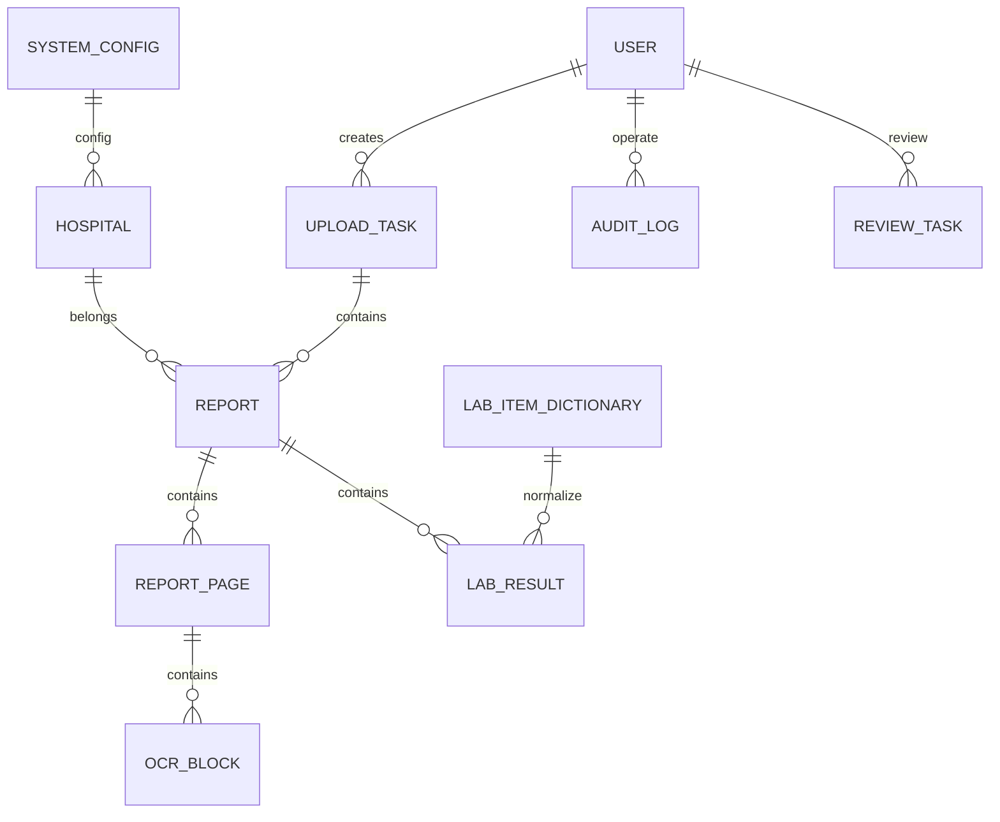

---

# 10.4 数据表规划

系统共设计以下核心数据表。

| 表名 | 说明 |
|------|------|
| sys_user | 用户 |
| sys_role | 角色 |
| sys_permission | 权限 |
| upload_task | 上传任务 |
| report | 报告主表 |
| report_page | 报告页面 |
| report_file | 文件信息 |
| ocr_block | OCR结果 |
| hospital | 医院 |
| hospital_parser | Parser配置 |
| lab_item_dictionary | 标准项目 |
| unit_dictionary | 单位 |
| lab_result | 检验结果 |
| review_task | 人工审核 |
| audit_log | 审计日志 |
| system_config | 系统配置 |

后续 V4.0 可增加：

- AI 诊断建议
- NLP 查询记录
- 模型训练数据
- FHIR 同步记录

---

# 10.5 report（报告主表）

保存一份完整化验单的信息。

```sql
report
```

字段设计：

| 字段 | 类型 | 说明 |
|------|------|------|
| id | bigint | 主键 |
| report_uuid | varchar(64) | UUID |
| report_no | varchar(100) | 报告编号 |
| hospital_id | bigint | 医院 |
| upload_task_id | bigint | 上传任务 |
| file_id | bigint | 来源文件 |
| report_title | varchar(200) | 报告标题 |
| sample_time | datetime | 采样时间 |
| report_time | datetime | 报告时间 |
| page_count | int | 页数 |
| parser_name | varchar(100) | Parser |
| parser_version | varchar(30) | Parser版本 |
| parse_status | varchar(20) | 状态 |
| quality_score | decimal(5,2) | 质量评分 |
| remark | varchar(500) | 备注 |
| deleted | tinyint | 逻辑删除 |
| create_time | datetime | 创建时间 |
| update_time | datetime | 更新时间 |

索引：

```sql
idx_report_uuid

idx_sample_time

idx_hospital

idx_status
```

---

# 10.6 report_file（文件信息表）

记录上传文件。

| 字段 | 类型 |
|------|------|
| id | bigint |
| report_id | bigint |
| original_name | varchar(500) |
| storage_name | varchar(200) |
| relative_path | varchar(1000) |
| absolute_path | varchar(1000) |
| md5 | char(32) |
| sha256 | char(64) |
| extension | varchar(20) |
| mime_type | varchar(100) |
| file_size | bigint |
| width | int |
| height | int |
| page_count | int |
| upload_time | datetime |

新增字段：

```
source_directory
```

用于记录：

```
D:\private\CS\CS\LabReport
```

来源。

---

# 10.7 report_page

每一页：

一条记录。

字段：

| 字段 | 类型 |
|------|------|
| id | bigint |
| report_id | bigint |
| page_no | int |
| page_type | varchar(20) |
| width | int |
| height | int |
| image_path | varchar(500) |
| thumbnail_path | varchar(500) |
| preview_path | varchar(500) |
| render_dpi | int |
| ocr_status | varchar(20) |
| create_time | datetime |

支持：

在线：

预览。

---

# 10.8 ocr_block

保存：

OCR。

每一块。

字段：

| 字段 | 类型 |
|------|------|
| id | bigint |
| report_page_id | bigint |
| block_index | int |
| text | text |
| confidence | decimal(5,4) |
| x | int |
| y | int |
| width | int |
| height | int |
| rotation | int |
| language | varchar(20) |
| create_time | datetime |

所有：

Bounding Box：

永久保存。

---

# 10.9 hospital

医院信息。

字段：

| 字段 | 类型 |
|------|------|
| id | bigint |
| hospital_name | varchar(200) |
| short_name | varchar(100) |
| province | varchar(50) |
| city | varchar(50) |
| level | varchar(20) |
| parser_name | varchar(100) |
| parser_version | varchar(20) |
| enable | tinyint |
| create_time | datetime |

支持：

后台：

维护。

---

# 10.10 hospital_parser

Parser。

版本管理。

字段：

| 字段 | 类型 |
|------|------|
| id | bigint |
| hospital_id | bigint |
| parser_name | varchar(100) |
| version | varchar(20) |
| config_file | varchar(300) |
| author | varchar(100) |
| release_time | datetime |
| enable | tinyint |

支持：

历史版本。

---

# 10.11 lab_item_dictionary

标准项目字典。

字段：

| 字段 | 类型 |
|------|------|
| id | bigint |
| standard_name | varchar(200) |
| abbreviation | varchar(50) |
| english_name | varchar(200) |
| category | varchar(100) |
| aliases | json |
| enable | tinyint |

索引：

```
standard_name

abbreviation
```

---

# 10.12 unit_dictionary

单位。

字段：

| 字段 | 类型 |
|------|------|
| id | bigint |
| raw_unit | varchar(50) |
| standard_unit | varchar(50) |
| convert_factor | decimal(20,8) |
| offset | decimal(20,8) |
| enable | tinyint |

支持：

自动：

换算。

---

# 10.13 lab_result

系统：

最核心。

数据表。

每一项检验结果：

一条记录。

字段如下：

| 字段 | 类型 | 说明 |
|------|------|------|
| id | bigint | 主键 |
| report_id | bigint | 报告 |
| page_id | bigint | 页 |
| ocr_block_id | bigint | OCR块 |
| hospital_id | bigint | 医院 |
| sample_time | datetime | 采样时间 |
| raw_item_name | varchar(200) | 原始名称 |
| standard_item_name | varchar(200) | 标准名称 |
| abbreviation | varchar(50) | 缩写 |
| raw_result | varchar(100) | 原始结果 |
| normalized_result | varchar(100) | 标准结果 |
| raw_unit | varchar(50) | 原单位 |
| standard_unit | varchar(50) | 标准单位 |
| reference_text | varchar(100) | 原参考范围 |
| reference_low | decimal(12,4) | 下限 |
| reference_high | decimal(12,4) | 上限 |
| raw_flag | varchar(20) | 原异常标记 |
| abnormal_flag | char(1) | H/L/N/A |
| quality_score | decimal(5,2) | 质量评分 |
| source_file | varchar(500) | 来源文件 |
| source_page | int | 来源页码 |
| bbox_x | int | X |
| bbox_y | int | Y |
| bbox_width | int | 宽 |
| bbox_height | int | 高 |
| review_status | varchar(20) | 审核状态 |
| create_time | datetime | 创建时间 |

**说明：**

该表完整保存：

- 原始值
- 标准值
- 来源文件
- OCR 坐标
- 质量评分
- 审核状态

保证数据全程可追溯。

---

# 10.14 review_task

人工审核任务。

字段：

| 字段 | 类型 |
|------|------|
| id | bigint |
| lab_result_id | bigint |
| review_type | varchar(50) |
| reason | varchar(500) |
| reviewer | bigint |
| review_result | varchar(50) |
| review_time | datetime |
| status | varchar(20) |

用于：

OCR 校对。

Parser 校对。

标准化校对。

---

# 10.15 audit_log

（下一节继续）
````
````markdown id="78264"
# 10.15 audit_log（审计日志表）

审计日志用于记录系统中所有重要操作，确保数据全程可追溯。

任何涉及：

- 新增
- 修改
- 删除
- 人工校对
- 标准化修正
- 配置修改
- 用户管理

均必须记录审计日志。

---

## 表结构

| 字段 | 类型 | 说明 |
|------|------|------|
| id | bigint | 主键 |
| module_name | varchar(100) | 模块名称 |
| business_type | varchar(50) | 操作类型 |
| business_id | bigint | 业务ID |
| operator_id | bigint | 操作用户 |
| operator_name | varchar(100) | 用户名 |
| ip_address | varchar(64) | IP地址 |
| browser | varchar(200) | 浏览器 |
| before_data | longtext | 修改前JSON |
| after_data | longtext | 修改后JSON |
| remark | varchar(500) | 修改原因 |
| operate_time | datetime | 操作时间 |

---

## 操作类型

统一采用枚举：

| 类型 | 含义 |
|------|------|
| INSERT | 新增 |
| UPDATE | 修改 |
| DELETE | 删除 |
| IMPORT | 导入 |
| EXPORT | 导出 |
| LOGIN | 登录 |
| LOGOUT | 退出 |
| REVIEW | 人工审核 |
| CONFIG | 配置修改 |

---

## 示例

修改：

```
ALT

35

↓

38
```

保存：

```json
{
  "before":{
    "result":"35"
  },
  "after":{
    "result":"38"
  }
}
```

支持：

历史版本。

数据恢复。

操作追踪。

---

# 10.16 upload_task（上传任务表）

上传任务管理。

字段：

| 字段 | 类型 |
|------|------|
| id | bigint |
| task_uuid | varchar(64) |
| task_name | varchar(200) |
| upload_type | varchar(20) |
| root_directory | varchar(1000) |
| total_files | int |
| success_files | int |
| failed_files | int |
| skipped_files | int |
| status | varchar(20) |
| progress | decimal(5,2) |
| start_time | datetime |
| finish_time | datetime |
| elapsed_time | bigint |
| create_user | bigint |
| create_time | datetime |

支持：

任务恢复。

断点续传（预留）。

---

# 10.17 sys_user

用户表。

字段：

| 字段 | 类型 |
|------|------|
| id | bigint |
| username | varchar(100) |
| password | varchar(200) |
| nickname | varchar(100) |
| email | varchar(200) |
| phone | varchar(50) |
| avatar | varchar(500) |
| role_id | bigint |
| status | tinyint |
| last_login_time | datetime |
| create_time | datetime |

密码：

采用：

```
BCrypt
```

加密。

禁止：

明文。

---

# 10.18 sys_role

角色。

字段：

| 字段 | 类型 |
|------|------|
| id | bigint |
| role_name | varchar(100) |
| role_code | varchar(100) |
| description | varchar(500) |
| enable | tinyint |

默认角色：

```
Admin

Doctor

User

Viewer
```

---

# 10.19 sys_permission

权限。

字段：

| 字段 | 类型 |
|------|------|
| id | bigint |
| permission_code | varchar(100) |
| permission_name | varchar(200) |
| module | varchar(100) |
| api | varchar(500) |
| method | varchar(20) |

权限：

采用：

RBAC。

---

# 10.20 system_config

系统配置。

全部：

数据库。

动态：

加载。

字段：

| 字段 | 类型 |
|------|------|
| id | bigint |
| config_key | varchar(200) |
| config_value | longtext |
| config_type | varchar(50) |
| description | varchar(500) |
| enable | tinyint |

例如：

```
OCR.Thread

OCR.GPU

Export.Excel.MaxRows

Upload.MaxSize

Parser.Timeout
```

后台：

可修改。

无需：

重启。

---

# 10.21 数据库索引设计

## report

建立：

```sql
idx_report_sample_time

idx_report_hospital

idx_report_uuid
```

---

## lab_result

建立：

```sql
idx_item

idx_abbreviation

idx_sample_time

idx_report

idx_hospital

idx_flag
```

支持：

趋势。

统计。

查询。

---

## ocr_block

建立：

```sql
idx_page

idx_confidence
```

---

## upload_task

建立：

```sql
idx_status

idx_start_time
```

---

## review_task

建立：

```sql
idx_review_status
```

---

# 10.22 外键设计

推荐：

业务：

逻辑外键。

数据库：

尽量：

避免：

大量：

Foreign Key。

原因：

提高：

导入速度。

关联：

由：

ORM。

维护。

---

# 10.23 数据库命名规范

表：

全部：

小写。

例如：

```
lab_result
```

字段：

全部：

snake_case。

例如：

```
sample_time
```

主键：

统一：

```
id
```

时间：

统一：

```
create_time

update_time
```

逻辑删除：

统一：

```
deleted
```

---

# 10.24 数据库分区（V4.0）

预计：

100万以上：

LabResult。

支持：

按：

年份：

分区。

例如：

```
2024

2025

2026
```

提高：

查询效率。

---

# 10.25 数据归档

历史：

超过：

5年。

自动：

归档。

例如：

```
Archive DB
```

仍可：

查询。

---

# 10.26 数据备份

建议：

每天：

全备。

每小时：

Binlog。

恢复：

任意时间点。

---

# 10.27 数据安全

数据库：

采用：

最小权限原则。

开发环境：

```
root/root
```

生产环境：

建议：

```
lab_user
```

仅：

业务权限。

数据库：

启用：

SSL（生产环境）。

---

# 10.28 本章总结

本章完成了 MySQL 数据库详细设计，包括核心数据表、索引、审计日志、权限体系、配置管理及数据库规范。

数据库设计遵循可扩展、可追溯、高性能原则，为系统稳定运行及后续 AI 扩展提供可靠的数据基础。

---

# 第十一章 REST API 设计

## 11.1 概述

系统采用 RESTful API 风格。

后端基于 **FastAPI** 实现，前端通过 HTTP/HTTPS 与后端通信。

所有接口统一返回 JSON，统一错误码、统一分页格式、统一鉴权方式（JWT）。

API 同时自动生成 OpenAPI（Swagger）文档，方便开发、测试及第三方系统集成。

---

# 11.2 API 设计原则

所有接口遵循以下规范：

- RESTful 风格
- HTTPS 通信
- JSON 数据格式
- UTF-8 编码
- JWT 鉴权
- 统一返回结构
- 幂等性设计
- 分页查询统一格式
- 错误码统一管理

---

# 11.3 API 路径规范

统一采用：

```text
/api/v1/
```

例如：

```text
/api/v1/login

/api/v1/upload

/api/v1/report

/api/v1/result

/api/v1/export
```

版本升级时：

新增：

```
v2
```

避免：

影响：

旧版本。

---

# 11.4 统一响应格式

所有接口：

统一返回：

```json
{
    "code":0,
    "message":"success",
    "data":{},
    "timestamp":"2026-07-18T10:25:30",
    "requestId":"2fc6d5f83e9a46e0"
}
```

其中：

| 字段 | 说明 |
|------|------|
| code | 状态码 |
| message | 提示信息 |
| data | 返回数据 |
| timestamp | 响应时间 |
| requestId | 请求追踪ID |

便于：

日志关联。

分布式追踪。

---

# 11.5 HTTP 状态码规范

| HTTP | 含义 |
|------|------|
| 200 | 成功 |
| 201 | 创建成功 |
| 400 | 请求参数错误 |
| 401 | 未登录 |
| 403 | 无权限 |
| 404 | 资源不存在 |
| 409 | 数据冲突 |
| 422 | 数据校验失败 |
| 500 | 服务器内部错误 |

（第十一章继续：登录认证、上传接口、报告管理、检验结果查询、导出接口、预览接口、系统配置接口及完整 OpenAPI 设计。）
````
````markdown id="41682"
# 11.6 错误码规范

除 HTTP 状态码外，系统定义统一业务错误码。

| 错误码 | 含义 |
|---------|------|
| 0 | 成功 |
| 1000 | 参数错误 |
| 1001 | Token 无效 |
| 1002 | Token 已过期 |
| 1003 | 无权限访问 |
| 1004 | 用户不存在 |
| 1005 | 用户名或密码错误 |
| 2000 | 上传失败 |
| 2001 | 文件格式不支持 |
| 2002 | 文件损坏 |
| 2003 | 文件重复 |
| 3000 | OCR 失败 |
| 3001 | PDF 解析失败 |
| 3002 | Parser 失败 |
| 3003 | 标准化失败 |
| 4000 | 数据不存在 |
| 4001 | 数据已删除 |
| 4002 | 数据已锁定 |
| 5000 | 导出失败 |
| 9000 | 系统异常 |

所有异常均返回统一 JSON 格式。

---

# 11.7 JWT 鉴权

系统采用：

```
JWT Access Token

+

Refresh Token
```

登录成功：

返回：

```json
{
    "access_token":"xxxx",
    "refresh_token":"yyyy",
    "expire":7200
}
```

请求头：

```
Authorization

Bearer xxxxx
```

Refresh Token：

用于：

自动续期。

---

# 11.8 登录接口

## POST

```
/api/v1/auth/login
```

请求：

```json
{
    "username":"admin",
    "password":"123456"
}
```

返回：

```json
{
    "code":0,
    "data":{
        "token":"xxxx",
        "refreshToken":"yyyy"
    }
}
```

---

# 11.9 用户信息接口

GET：

```
/api/v1/auth/me
```

返回：

```json
{
    "username":"admin",
    "nickname":"Administrator",
    "roles":[
        "Admin"
    ]
}
```

---

# 11.10 上传接口

支持：

单文件。

多文件。

整个目录。

---

## 上传单文件

POST：

```
/api/v1/upload/file
```

FormData：

```
file
```

返回：

TaskID。

---

## 上传多个文件

POST：

```
/api/v1/upload/files
```

FormData：

```
files[]
```

后台：

自动：

创建：

Task。

---

## 上传目录

POST：

```
/api/v1/upload/folder
```

前端：

递归：

读取：

目录。

保持：

目录结构。

上传：

后台。

---

请求：

```text
Folder

├── A.pdf

├── B.pdf

└── Child

    ├── C.pdf

    └── D.jpg
```

服务器：

自动：

解析。

---

# 11.11 查询任务

GET：

```
/api/v1/task/{id}
```

返回：

```json
{
    "status":"Running",
    "progress":63.5,
    "totalFiles":120,
    "success":75,
    "failed":2
}
```

支持：

实时刷新。

---

# 11.12 获取任务列表

GET：

```
/api/v1/task/list
```

支持：

分页。

排序。

过滤。

---

参数：

```
page

size

status

keyword
```

---

# 11.13 获取报告列表

GET：

```
/api/v1/report/list
```

查询条件：

```
医院

日期

关键字

文件名

Parser

状态
```

支持：

分页。

---

# 11.14 查询报告详情

GET：

```
/api/v1/report/{id}
```

返回：

Header。

页面。

检验结果。

OCR。

质量评分。

来源文件。

---

# 11.15 查询检验结果

GET：

```
/api/v1/result/list
```

支持：

按：

```
医院

日期

项目

缩写

异常

单位
```

过滤。

---

返回：

分页：

JSON。

---

# 11.16 趋势分析接口

GET：

```
/api/v1/result/trend
```

参数：

```
item=ALT

start=2020

end=2026
```

返回：

```json
[
    {
        "date":"2020-03-01",
        "value":26
    },
    {
        "date":"2021-07-12",
        "value":32
    }
]
```

供：

ECharts。

直接：

使用。

---

# 11.17 在线预览接口

GET：

```
/api/v1/report/{id}/preview
```

返回：

```json
{
    "pages":[
        {
            "page":1,
            "image":"page001.png"
        }
    ]
}
```

支持：

PDF。

图片。

---

# 11.18 OCR 查询接口

GET：

```
/api/v1/report/{id}/ocr
```

返回：

OCRBlock。

包括：

Bounding Box。

用于：

调试。

校对。

---

# 11.19 点击指标定位接口

GET：

```
/api/v1/result/{id}/location
```

返回：

```json
{
    "page":2,
    "x":325,
    "y":486,
    "width":118,
    "height":28
}
```

前端：

直接：

定位。

高亮。

无需：

重新 OCR。

---

# 11.20 导出接口

POST：

```
/api/v1/export
```

参数：

```
Excel

CSV

JSON
```

支持：

导出：

查询结果。

全部数据。

指定医院。

指定时间。

---

返回：

下载地址。

---

# 11.21 医院管理接口

包括：

```
新增医院

删除医院

修改医院

启停Parser

更新模板
```

API：

```
/api/v1/hospital/*
```

---

# 11.22 标准字典接口

包括：

```
新增项目

修改项目

新增别名

导入字典

导出字典
```

API：

```
/api/v1/dictionary/*
```

---

# 11.23 系统配置接口

包括：

```
OCR

Parser

Redis

MySQL

Export

Upload
```

统一：

```
/api/v1/config/*
```

后台：

修改。

立即：

生效。

---

# 11.24 审计日志接口

GET：

```
/api/v1/audit/list
```

支持：

查询：

```
用户

模块

时间

操作
```

支持：

导出。

---

# 11.25 Swagger

FastAPI：

自动：

生成：

```
/docs
```

ReDoc：

```
/redoc
```

无需：

额外开发。

---

# 11.26 API 安全

采用：

- JWT
- HTTPS
- CORS
- Rate Limit
- SQL Injection 防护
- XSS 防护
- CSRF 防护（Cookie 模式）
- 请求日志
- 接口签名（预留）

---

# 11.27 API 性能目标

| 指标 | 目标 |
|------|------:|
| 普通查询 | ≤200ms |
| 分页查询 | ≤500ms |
| 上传响应 | ≤300ms |
| OCR接口 | 异步 |
| 导出接口 | 异步 |
| 并发用户 | ≥500 |

---

# 11.28 本章总结

本章完成了 REST API 的详细设计，包括接口规范、JWT 鉴权、统一返回结构、上传、查询、预览、导出、趋势分析及系统管理接口，为前后端分离架构提供完整的通信规范。

---

# 第十二章 前端系统设计

## 12.1 概述

前端采用 **Vue 3 + TypeScript + Vite + Element Plus** 技术栈，实现现代化、响应式、前后端分离的 Web 应用。

系统支持：

- 整个目录上传
- 多文件上传
- 拖拽上传
- PDF 在线预览
- 图片在线预览
- 检验指标定位
- 趋势图展示
- 数据导出
- 人工审核
- 系统配置
- 医院模板管理

前端通过 REST API 与 FastAPI 后端通信，不直接访问数据库。

---

# 12.2 技术架构

推荐技术栈：

| 模块 | 技术 |
|------|------|
| 框架 | Vue 3 |
| 语言 | TypeScript |
| 构建 | Vite |
| UI | Element Plus |
| 路由 | Vue Router |
| 状态管理 | Pinia |
| HTTP | Axios |
| 图表 | ECharts |
| PDF预览 | PDF.js |
| 图片预览 | Viewer.js |
| 样式 | SCSS |
| 权限 | JWT + Router Guard |

整体架构如下：

```text
Vue App
│
├── Layout
├── Router
├── Pinia Store
├── API
├── Views
├── Components
├── Utils
└── Assets
```

（第十二章继续：页面结构设计、组件划分、目录上传实现、PDF 在线预览、Bounding Box 高亮、趋势图、后台管理等内容。）
````
````markdown id="53781"
# 12.3 前端目录结构

推荐采用如下目录结构：

```text
src/
│
├── api/
│   ├── auth.ts
│   ├── upload.ts
│   ├── report.ts
│   ├── result.ts
│   ├── hospital.ts
│   ├── dictionary.ts
│   ├── review.ts
│   ├── export.ts
│   ├── config.ts
│   └── system.ts
│
├── assets/
│
├── components/
│   ├── Upload/
│   ├── Preview/
│   ├── Trend/
│   ├── ResultTable/
│   ├── BoundingBox/
│   ├── Review/
│   ├── Common/
│   └── Layout/
│
├── layouts/
│
├── router/
│
├── store/
│
├── styles/
│
├── utils/
│
├── views/
│
├── App.vue
│
└── main.ts
```

组件全部采用 Composition API。

---

# 12.4 页面规划

系统主要页面如下：

| 页面 | 功能 |
|------|------|
| 登录 | 用户认证 |
| 首页 Dashboard | 系统统计 |
| 上传中心 | 上传文件 |
| 上传任务 | 查看任务 |
| 报告管理 | 查看报告 |
| 检验结果 | 查看指标 |
| 在线预览 | PDF/图片 |
| 人工审核 | OCR校对 |
| 趋势分析 | 图表 |
| 医院管理 | Parser |
| 标准字典 | Normalize |
| 系统配置 | Config |
| 用户管理 | RBAC |
| 日志中心 | Audit |

---

# 12.5 Dashboard

首页展示：

```
今日上传

报告数量

OCR成功率

Parser成功率

异常数量

医院数量

CPU

内存

任务队列
```

采用：

Card。

图表。

实时刷新。

---

## Dashboard 示例

```text
┌───────────────────────────────────────┐
│ 今日上传        128                    │
│ OCR成功率       99.83%                 │
│ Parser成功率    99.21%                 │
│ Review          12                     │
└───────────────────────────────────────┘
```

支持：

自动刷新。

---

# 12.6 上传中心

上传方式：

- 单文件
- 多文件
- 整个目录
- 拖拽上传

---

支持：

HTML5：

```
webkitdirectory
```

实现：

目录上传。

保持：

目录层级。

---

上传界面：

```text
┌────────────────────────────┐

  点击上传

      或

  拖拽到这里

└────────────────────────────┘
```

支持：

PDF。

图片。

---

# 12.7 上传进度

上传：

实时：

显示：

```
██████████

78%
```

支持：

每个文件：

独立：

进度。

整体：

进度。

---

失败：

自动：

重试。

---

# 12.8 上传任务页面

显示：

| 字段 |
|------|
| Task |
| 状态 |
| 文件数 |
| 成功 |
| 失败 |
| OCR |
| Parser |
| 时间 |

支持：

暂停。

恢复。

取消。

重新解析。

---

# 12.9 报告管理

显示：

所有：

Report。

支持：

搜索：

```
医院

文件名

日期

Parser

状态
```

支持：

分页。

排序。

---

点击：

进入：

详情。

---

# 12.10 报告详情

包括：

```
Header

页面

检验结果

OCR

日志
```

左侧：

报告。

右侧：

指标。

---

布局：

```text
+----------------+--------------------+

 PDF Preview      Result Table

+----------------+--------------------+
```

---

# 12.11 PDF 在线预览

采用：

```
PDF.js
```

支持：

- 多页
- 缩放
- 搜索
- 打印（可配置）
- 缩略图
- 页面跳转

支持：

扫描 PDF。

文字 PDF。

---

# 12.12 图片预览

图片：

采用：

Viewer.js。

支持：

- 放大
- 缩小
- 拖动
- 旋转
- 全屏
- 下载（权限控制）

---

# 12.13 Bounding Box 高亮

点击：

```
ALT
```

↓

PDF：

自动：

滚动。

↓

定位。

↓

高亮。

效果：

```text
+-------------------------+

      ALT

 ┌────────────┐

 │    ALT     │

 └────────────┘

+-------------------------+
```

Bounding Box：

直接：

读取：

数据库。

无需：

OCR。

---

# 12.14 检验结果页面

采用：

Element Plus Table。

显示：

| 字段 |
|------|
| 项目 |
| 缩写 |
| 结果 |
| 单位 |
| 范围 |
| 异常 |
| 医院 |
| 日期 |
| 来源文件 |

支持：

点击：

跳转：

PDF。

---

# 12.15 趋势分析

采用：

```
ECharts
```

例如：

ALT：

```
40

30

20

10

2020

2021

2022

2023

2024
```

支持：

多个：

指标。

同时：

显示。

---

支持：

导出：

PNG。

PDF。

---

# 12.16 OCR 校对

左：

PDF。

右：

OCR。

修改：

立即：

保存。

记录：

Audit。

---

支持：

快捷键：

```
Enter

Tab

↑

↓

Ctrl+S
```

提高：

效率。

---

# 12.17 人工审核

Review：

页面。

显示：

```
OCR低置信度

未知项目

未知单位

未知医院

Parser失败
```

审核后：

重新：

Normalize。

---

# 12.18 医院管理

支持：

```
新增医院

Parser

模板

Logo

版本

启停
```

后台：

热更新。

---

# 12.19 标准字典管理

支持：

维护：

```
项目

别名

缩写

单位

参考范围
```

支持：

Excel：

导入。

导出。

---

# 12.20 系统配置

配置：

```
OCR

GPU

线程

Redis

MySQL

Export

Upload
```

修改：

立即：

生效。

---

# 12.21 用户管理

支持：

```
用户

角色

权限

密码

头像
```

RBAC。

---

# 12.22 日志中心

查看：

```
系统日志

OCR日志

Parser日志

Audit日志
```

支持：

下载。

搜索。

过滤。

---

# 12.23 消息通知

支持：

Element Plus：

Notification。

例如：

```
上传成功

OCR完成

Parser完成

导出完成

审核完成
```

支持：

WebSocket。

实时：

推送。

---

# 12.24 国际化（V4.0）

支持：

```
中文

English
```

采用：

```
vue-i18n
```

---

# 12.25 响应式布局

支持：

```
1920

1600

1440

1366

1280
```

后续：

支持：

Pad。

---

# 12.26 权限控制

采用：

```
Router Guard

+

Button Permission
```

例如：

Viewer：

不可：

删除。

Admin：

全部。

---

# 12.27 前端缓存

采用：

```
Pinia

SessionStorage

LocalStorage
```

缓存：

Token。

用户。

配置。

---

# 12.28 前端性能优化

采用：

- 路由懒加载
- 图片懒加载
- 虚拟滚动
- 表格分页
- Axios 缓存
- WebSocket 增量更新
- CDN（生产环境）
- Gzip/Brotli 压缩

---

# 12.29 本章总结

本章完成了前端系统设计，包括页面规划、目录上传、在线预览、Bounding Box 联动、趋势分析、人工审核、后台管理及性能优化，为前后端分离架构提供完整的 UI 设计方案。

---

# 第十三章 Parser 解析引擎详细设计

## 13.1 概述

Parser 是整个 LabReportParser V3.0 的核心业务引擎。

OCR 或 PDF 文本提取仅负责获取原始文本，而 Parser 负责从这些文本中识别并提取具有医学意义的数据，例如：

- 医院名称
- 报告编号
- 采样日期
- 检验项目
- 检验结果
- 单位
- 参考范围
- 异常标记

Parser 最终输出统一的 `LabResult` 对象，并交由标准化引擎处理。

本章将详细介绍 Parser 架构、规则引擎、模板机制、字段识别算法、多医院适配及异常处理策略。
````
````markdown id="68427"
# 13.2 Parser 总体架构

Parser 采用"规则引擎 + 插件化解析器 + 通用解析器"三层架构。

整体流程如下：

```mermaid
flowchart LR

OCR/Text

-->

Parser Engine

-->

Header Parser

-->

Table Parser

-->

Field Parser

-->

Rule Engine

-->

LabResult

-->

Normalize
```

Parser 不直接依赖 OCR。

无论数据来源于：

- OCR
- PDF文字
- API
- JSON

均可解析。

---

# 13.3 Parser 模块组成

```text
Parser
│
├── ParserEngine
├── HeaderParser
├── TableParser
├── ItemParser
├── FieldMatcher
├── RuleEngine
├── ParserFactory
├── CommonParser
├── BaseParser
└── HospitalParser
```

模块职责：

| 模块 | 职责 |
|------|------|
| ParserEngine | 总调度 |
| HeaderParser | 页眉解析 |
| TableParser | 表格解析 |
| ItemParser | 项目解析 |
| FieldMatcher | 字段匹配 |
| RuleEngine | 规则计算 |
| ParserFactory | 创建 Parser |
| CommonParser | 通用解析 |
| HospitalParser | 医院专用解析 |

---

# 13.4 ParserEngine

统一入口：

```text
ParserEngine

├── parse()

├── parse_header()

├── parse_table()

├── parse_footer()

├── merge()

└── validate()
```

所有 Parser：

最终：

调用：

```
parse()
```

---

# 13.5 HeaderParser

负责：

识别：

```
医院名称

报告编号

姓名（可脱敏）

性别

年龄

科室

住院号

门诊号

采样时间

报告时间
```

注意：

患者个人敏感信息默认不入库。

如业务需要，应采用脱敏或加密存储，并符合相关隐私法规。

---

## Header 输出

```json
{
  "hospital":"北京协和医院",
  "sample_time":"2026-07-18 08:30:00",
  "report_no":"202607180001"
}
```

---

# 13.6 TableParser

负责：

识别：

检验项目表格。

例如：

```text
项目

结果

单位

参考范围

标记
```

支持：

- 有边框表格
- 无边框表格
- OCR 文本
- PDF Text

统一输出：

二维表。

---

# 13.7 表格检测

采用：

多策略。

包括：

- OCR 坐标
- Bounding Box
- 横线
- 竖线
- 字体位置
- 行间距

生成：

```
Table
```

对象。

---

# 13.8 行识别

例如：

```text
ALT

35

U/L

9~50

↑
```

生成：

```json
{
  "item":"ALT",
  "result":"35",
  "unit":"U/L",
  "reference":"9~50",
  "flag":"↑"
}
```

---

# 13.9 ItemParser

负责：

识别：

每一项。

例如：

```
谷丙转氨酶

35

U/L
```

输出：

```
Item
```

对象。

---

# 13.10 FieldMatcher

根据：

OCR：

坐标。

判断：

字段。

例如：

```
ALT

35

U/L
```

坐标：

```
x=100

↓

项目

x=260

↓

结果

x=380

↓

单位
```

无需：

固定：

列宽。

---

# 13.11 Rule Engine

Parser：

规则：

统一：

YAML。

例如：

```yaml
header:

  hospital:

    regex:

      - 北京协和医院

table:

  columns:

    item:0

    result:1

    unit:2

    range:3

    flag:4
```

Parser：

无需：

硬编码。

---

# 13.12 多规则匹配

支持：

```
Regex

+

Keyword

+

Position

+

Confidence
```

综合：

评分。

避免：

误识别。

---

# 13.13 Parser 输出对象

统一：

```
LabResult
```

```python
LabResult(

    hospital="北京协和医院",

    sample_time="2026-07-18",

    item_name="谷丙转氨酶",

    abbreviation="ALT",

    result="35",

    unit="U/L",

    reference="9~50",

    flag="↑"

)
```

统一：

进入：

Normalize。

---

# 13.14 多页合并

部分报告：

例如：

```
Page1

↓

项目

Page2

↓

继续
```

Parser：

自动：

合并。

保证：

完整。

---

# 13.15 重复项目处理

例如：

```
ALT

35

ALT

35
```

判断：

重复。

仅：

保留：

一条。

或：

按配置：

全部保留。

---

# 13.16 OCR 与 PDF 合并

若：

文字 PDF：

```
Text
```

OCR：

```
OCR
```

Parser：

优先：

Text。

OCR：

作为：

补充。

提高：

准确率。

---

# 13.17 Parser 校验

检查：

```
项目为空

结果为空

单位为空

日期为空
```

异常：

进入：

Review。

---

# 13.18 Parser 日志

记录：

```
Header

Table

Item

Rule

耗时

异常
```

例如：

```text
Parser

Hospital:

北京协和医院

Rows:

62

Cost:

42ms

Status:

Success
```

---

# 13.19 Parser 性能优化

采用：

- 规则缓存
- YAML 缓存
- 多线程
- Redis 字典缓存
- OCR 共享
- 懒解析
- 增量解析

---

# 13.20 Parser 插件规范

每个 Parser：

目录：

```text
plugins/

hospital/

xxx/

parser.py

config.yaml

tests/

README.md
```

必须：

实现：

```python
class BaseParser:

    def parse(self):

        pass
```

---

# 13.21 Parser 单元测试

每个 Parser：

至少：

覆盖：

```
Header

Items

Footer

异常

OCR

PDF
```

覆盖率：

建议：

95%以上。

---

# 13.22 Parser 性能目标

| 指标 | 目标 |
|------|------:|
| Header | ≤10ms |
| Table | ≤30ms |
| Page | ≤50ms |
| Report | ≤150ms |
| 成功率 | ≥99% |

---

# 13.23 Parser 扩展规划（V4.0）

未来支持：

- AI Parser（LLM 辅助解析）
- 自学习规则生成
- 自动模板发现
- 半自动字段映射
- 多语言报告解析
- 海外医院模板

---

# 13.24 本章总结

本章完成了 Parser 解析引擎设计，包括整体架构、字段解析、规则引擎、插件机制、性能优化及未来 AI 扩展方案。

Parser 作为连接 OCR、PDF 与标准化模块的核心桥梁，实现了不同医院、不同版式检验报告的统一解析。

---

# 第十四章 文件存储与缓存设计

## 14.1 概述

文件存储模块负责管理系统中的所有原始文件、PDF 渲染图片、OCR 缓存、缩略图、导出文件及临时文件。

设计目标：

- 永久保存原始化验单
- 支持目录上传
- 支持文件秒传（去重）
- 支持在线预览
- 支持缓存复用
- 支持后续对象存储（MinIO、S3、OSS）扩展
- 保证数据可追溯与可恢复

本章将详细介绍目录结构、文件命名规范、缓存策略、生命周期管理及存储扩展设计。
````
````markdown id="27164"
# 14.2 文件存储总体架构

系统采用分层存储架构。

```mermaid
flowchart LR

Upload

-->

Storage Manager

-->

Original File

-->

Preview

-->

OCR Cache

-->

Thumbnail

-->

Export

-->

Archive
```

所有文件统一由 **StorageManager** 管理。

业务模块不得直接操作文件系统。

---

# 14.3 StorageManager 设计

统一接口：

```text
StorageManager

├── save()

├── load()

├── delete()

├── move()

├── exists()

├── checksum()

├── thumbnail()

├── archive()

└── restore()
```

所有文件操作均通过 StorageManager 完成。

---

# 14.4 存储目录结构

推荐目录：

```text
storage/
│
├── upload/
│   ├── original/
│   ├── image/
│   ├── pdf/
│   └── temp/
│
├── preview/
│
├── thumbnail/
│
├── ocr/
│
├── cache/
│   ├── pdf/
│   ├── ocr/
│   └── normalize/
│
├── export/
│
├── archive/
│
└── logs/
```

各目录职责：

| 目录 | 说明 |
|------|------|
| original | 原始上传文件 |
| image | PDF 转图片 |
| preview | 在线预览图片 |
| thumbnail | 缩略图 |
| ocr | OCR JSON |
| cache | 各类缓存 |
| export | 导出文件 |
| archive | 历史归档 |
| logs | 文件相关日志 |

---

# 14.5 文件命名规范

采用 UUID。

例如：

```
9d8e7baf-4a61-4d12-a0d2-90b5b60b8a42.pdf
```

数据库保存：

```
原文件名

UUID

SHA256

MD5

大小

路径
```

保证：

即使原文件重名。

仍不会冲突。

---

# 14.6 目录分层

推荐：

按：

日期。

```text
original/

2026/

    07/

        18/

            xxxx.pdf
```

避免：

单目录：

几十万文件。

---

# 14.7 文件去重

上传：

首先：

计算：

```
SHA256
```

数据库：

查询。

若：

存在。

则：

无需：

重新保存。

直接：

建立：

引用关系。

支持：

秒传。

---

流程：

```mermaid
flowchart TD

上传文件

↓

SHA256

↓

数据库查询

↓

存在？

↓

Yes

↓

建立引用

↓

No

↓

保存文件
```

---

# 14.8 原始文件永久保存

原始文件：

永不修改。

永不覆盖。

OCR。

Normalize。

Parser。

均：

读取：

副本。

保证：

审计。

---

# 14.9 PDF 预览图片

PDF：

Render：

PNG。

目录：

```text
preview/

report_uuid/

page001.png

page002.png
```

支持：

在线浏览。

---

# 14.10 缩略图

自动：

生成：

缩略图。

例如：

```
256px
```

用于：

列表。

提高：

速度。

---

目录：

```text
thumbnail/

report_uuid/

page001.jpg
```

---

# 14.11 OCR JSON

OCR：

结果：

JSON。

目录：

```text
ocr/

report_uuid/

page001.json
```

内容：

```
Text

BBox

Confidence
```

支持：

重新解析。

无需：

OCR。

---

# 14.12 Cache

缓存：

包括：

```
PDF

OCR

Normalize

Parser
```

统一：

TTL。

后台：

可配置。

---

Redis：

缓存：

热点。

磁盘：

缓存：

大文件。

---

# 14.13 Export

导出：

统一：

保存：

```text
export/

2026/

07/

18/

result.xlsx
```

支持：

自动：

过期：

删除。

默认：

7天。

---

# 14.14 Archive

历史：

归档。

例如：

5年以上。

移动：

```
archive/
```

数据库：

记录：

归档路径。

仍可：

查询。

---

# 14.15 Storage 配置

配置：

```yaml
storage:

  root: storage/

  preview: preview/

  thumbnail: thumbnail/

  archive: archive/

  export: export/

  keep_days: 3650

  export_days: 7
```

后台：

动态：

修改。

---

# 14.16 文件生命周期

```mermaid
stateDiagram-v2

[*] --> Upload

Upload --> Original

Original --> OCR

OCR --> Parser

Parser --> Database

Database --> Export

Database --> Archive

Archive --> Delete
```

删除：

默认：

逻辑删除。

管理员：

可恢复。

---

# 14.17 对象存储扩展（V4.0）

StorageManager：

支持：

适配器。

```text
StorageAdapter

│

├── LocalStorage

├── MinIOStorage

├── OSSStorage

├── S3Storage

└── AzureBlobStorage
```

业务：

无需修改。

---

# 14.18 文件安全

采用：

- SHA256 校验
- MIME 校验
- 文件类型白名单
- 上传大小限制
- 防路径穿越
- 防恶意文件
- 下载权限控制

所有下载请求均进行权限验证。

---

# 14.19 文件恢复

支持：

误删恢复。

流程：

```
逻辑删除

↓

回收站

↓

恢复

↓

继续使用
```

彻底删除：

需：

管理员。

---

# 14.20 存储性能优化

采用：

- 异步写盘
- 分目录存储
- 文件秒传
- Thumbnail 缓存
- Render 缓存
- CDN（生产环境）
- Gzip（文本文件）
- 增量同步（预留）

---

# 14.21 本章总结

本章完成了文件存储与缓存系统设计，包括目录结构、生命周期、缓存机制、秒传、对象存储扩展及安全策略。

StorageManager 作为统一存储入口，确保所有文件具备高可靠性、可追溯性及良好的扩展能力。

---

# 第十五章 人工审核（Review）系统设计

## 15.1 概述

自动解析并不能保证所有检验结果均达到 100% 准确率。

对于以下情况：

- OCR 置信度低
- 未知医院
- 未知检验项目
- 未知单位
- 参考范围异常
- Parser 无法识别
- 数据冲突

系统自动进入 **Review（人工审核）** 模块。

Review 模块支持在线校对、原图定位、修改留痕、审核流程及批量处理，是保证数据质量的重要组成部分。

---

# 15.2 Review 总体架构

```mermaid
flowchart LR

Parser

-->

Normalize

-->

Validator

-->

Review Queue

-->

Reviewer

-->

Approve

-->

MySQL
```

所有需人工确认的数据均进入 Review Queue，审核完成后再写入正式状态或更新已有记录。

---

# 15.3 Review 模块组成

```text
Review
│
├── ReviewQueue
├── ReviewService
├── ReviewEditor
├── BoundingBoxViewer
├── DiffViewer
├── ApprovalFlow
├── ReviewHistory
└── ReviewStatistics
```

各模块职责将在下一节详细说明。
````
````markdown id="81562"
# 15.4 ReviewQueue（审核队列）

ReviewQueue 是整个审核模块的入口。

所有需要人工确认的数据统一进入审核队列。

来源包括：

- OCR 低置信度
- Parser 无法解析
- 标准化失败
- 单位无法识别
- 参考范围异常
- 医院无法识别
- 用户主动提交审核

---

## 队列状态

统一采用如下状态：

| 状态 | 说明 |
|------|------|
| Pending | 待审核 |
| Assigned | 已分配 |
| Reviewing | 审核中 |
| Approved | 审核通过 |
| Rejected | 驳回 |
| ReParse | 重新解析 |
| Closed | 已关闭 |

---

## 优先级

支持：

```
High

Medium

Low
```

例如：

OCR：

置信度：

```
<0.70
```

自动：

High。

---

# 15.5 ReviewService

统一接口：

```text
ReviewService

├── create_task()

├── assign()

├── approve()

├── reject()

├── reopen()

├── statistics()

└── history()
```

所有审核操作：

统一：

ReviewService。

---

# 15.6 Review 页面布局

推荐：

双栏布局。

```text
┌──────────────────────┬──────────────────────────┐

      PDF / 图片                检验结果

└──────────────────────┴──────────────────────────┘
```

左侧：

原始化验单。

右侧：

解析结果。

点击：

任何：

字段。

立即：

定位。

---

# 15.7 Bounding Box 联动

点击：

```
ALT
```

↓

PDF：

自动：

滚动。

↓

Bounding Box：

高亮。

效果：

```text
ALT

┌───────────┐

│   ALT     │

└───────────┘
```

支持：

多个：

Bounding Box。

---

# 15.8 字段编辑

允许：

修改：

```
项目

结果

单位

参考范围

异常

日期
```

修改：

立即：

保存。

生成：

Audit。

---

# 15.9 OCR 原文查看

支持：

查看：

OCR：

文本。

例如：

```
ALT

35

U/L
```

与：

Parser。

对比。

方便：

定位问题。

---

# 15.10 Diff 对比

显示：

修改前。

修改后。

例如：

```text
Result

35

↓

38
```

颜色：

区分。

支持：

一键：

恢复。

---

# 15.11 批量审核

支持：

批量：

```
Approve

Reject

ReParse
```

提高：

效率。

---

# 15.12 自动审核

支持：

规则。

例如：

OCR：

```
confidence > 0.99
```

Parser：

正常。

自动：

Approve。

无需：

人工。

---

# 15.13 审核意见

审核人：

填写：

```
备注

原因

建议
```

永久：

保存。

---

# 15.14 审核历史

保存：

每一次：

修改。

例如：

```
2026-07-18

Admin

35

↓

38
```

支持：

回放。

恢复。

---

# 15.15 审核统计

统计：

```
待审核

已完成

平均耗时

审核成功率

人员工作量
```

Dashboard：

展示。

---

# 15.16 审核权限

RBAC：

控制。

例如：

| 角色 | 权限 |
|------|------|
| Viewer | 只读 |
| User | 提交审核 |
| Doctor | 审核 |
| Admin | 全部 |

---

# 15.17 Review API

包括：

```
创建任务

获取列表

详情

审核

退回

历史

统计
```

统一：

```
/api/v1/review/*
```

---

# 15.18 Review 日志

记录：

```
审核人

审核时间

修改字段

修改前

修改后
```

永久：

保存。

---

# 15.19 Review 性能目标

| 指标 | 目标 |
|------|------:|
| 打开审核页面 | ≤1 秒 |
| Bounding Box 定位 | ≤200ms |
| 保存修改 | ≤300ms |
| 批量审核100条 | ≤5 秒 |

---

# 15.20 本章总结

本章完成了人工审核系统设计，包括审核队列、在线校对、Bounding Box 联动、批量审核、自动审核、审计日志及权限管理，为系统提供最终的数据质量保障。

---

# 第十六章 系统安全设计

## 16.1 概述

LabReportParser 涉及医疗检验数据，应遵循最小权限、数据完整性和隐私保护原则。

安全设计覆盖：

- 身份认证
- 权限控制
- 数据安全
- 文件安全
- 接口安全
- 日志审计
- 网络安全
- 运维安全

系统设计兼顾开发环境（root/root）与生产环境的安全要求。

---

# 16.2 安全总体架构

```mermaid
flowchart TD

User

-->

JWT

-->

API Gateway

-->

RBAC

-->

FastAPI

-->

MySQL

-->

Audit

-->

Monitor
```

所有请求均经过统一认证与授权后进入业务模块。

---

# 16.3 身份认证

采用：

JWT。

包含：

- Access Token
- Refresh Token

Token：

默认：

2 小时有效。

Refresh：

默认：

7 天。

支持：

主动注销。

强制失效。

---

# 16.4 密码安全

密码：

采用：

```
BCrypt
```

加密。

禁止：

明文。

禁止：

MD5。

支持：

密码复杂度策略：

- 最少 8 位
- 大小写字母
- 数字
- 特殊字符（可配置）

支持：

密码过期提醒（预留）。

---

# 16.5 RBAC 权限控制

系统采用：

Role-Based Access Control。

权限粒度：

- 菜单
- 页面
- 按钮
- API
- 数据范围

权限模型：

```text
User

↓

Role

↓

Permission

↓

API
```

所有接口默认需要鉴权，匿名访问接口需显式配置。

---

# 16.6 数据权限

支持：

按角色限制数据范围。

例如：

Doctor：

仅查看本科室数据（如启用患者管理）。

Admin：

查看全部数据。

当前版本默认按系统角色控制，患者数据权限可在 V4.0 扩展。

---

# 16.7 敏感数据保护

系统默认不保存患者敏感身份信息。

若业务需要保存：

建议采用：

- AES 加密
- 数据脱敏
- 字段级权限控制

日志中不得记录身份证号、手机号等完整敏感信息。

---

# 16.8 HTTPS

生产环境：

必须：

启用：

HTTPS。

禁止：

HTTP。

支持：

TLS 1.2+

推荐：

TLS 1.3。

---

# 16.9 SQL 注入防护

全部：

SQL。

采用：

ORM。

参数化查询。

禁止：

字符串拼接 SQL。

---

# 16.10 XSS 防护

前端：

统一：

HTML Escape。

后端：

输入校验。

输出编码。

防止：

脚本注入。

---

# 16.11 CSRF 防护

JWT Header 模式默认风险较低。

若采用 Cookie：

启用：

CSRF Token。

SameSite。

HttpOnly。

Secure。

---

# 16.12 文件上传安全

上传前：

检查：

- MIME Type
- 文件后缀
- 文件大小
- SHA256
- 病毒扫描接口（预留）

禁止：

执行型文件。

例如：

```
.exe

.bat

.sh
```

---

# 16.13 文件下载权限

所有下载：

必须：

校验：

用户权限。

禁止：

直接：

暴露：

物理路径。

统一：

通过：

Download API。

---

# 16.14 审计日志

所有关键操作：

必须：

记录。

包括：

登录。

删除。

审核。

导出。

配置修改。

权限变更。

支持：

长期保存。

（第十六章继续：接口限流、日志安全、备份恢复、安全基线、运维安全、漏洞防护及系统监控设计。）
````
````markdown id="92417"
# 16.15 接口限流（Rate Limit）

为防止恶意请求、暴力破解及接口滥用，系统对所有开放接口实施限流策略。

推荐采用：

- FastAPI Middleware
- Redis Token Bucket
- Nginx Limit Request

限流规则示例：

| 接口 | 限制 |
|------|------|
| 登录 | 5 次/分钟/IP |
| 上传 | 20 次/分钟/用户 |
| 查询 | 300 次/分钟/用户 |
| 导出 | 10 次/小时/用户 |
| OCR | 50 次/分钟/任务 |

超过限制：

返回：

```json
{
    "code":429,
    "message":"Too Many Requests"
}
```

---

# 16.16 登录安全

支持：

- 登录失败次数限制
- CAPTCHA（可配置）
- IP 黑名单
- 登录审计
- 异地登录提醒（V4.0）
- 多因素认证（V4.0）

建议：

连续登录失败：

```
5 次
```

锁定：

```
30 分钟
```

---

# 16.17 Token 管理

JWT Token：

采用：

```
Access Token

+

Refresh Token
```

支持：

- 主动注销
- Token 黑名单
- 强制失效
- 单点登录（可配置）
- 多终端登录控制

Redis 保存：

Refresh Token。

---

# 16.18 日志安全

日志：

禁止：

记录：

- 密码
- Token
- Access Key
- 数据库密码
- 身份证号
- 手机号完整信息

日志等级：

| Level | 用途 |
|------|------|
| DEBUG | 开发 |
| INFO | 正常 |
| WARN | 告警 |
| ERROR | 异常 |
| FATAL | 严重故障 |

日志：

统一：

JSON。

方便：

ELK。

---

# 16.19 配置安全

所有敏感配置：

采用：

```
.env
```

例如：

```
MYSQL_PASSWORD

JWT_SECRET

REDIS_PASSWORD

MINIO_SECRET
```

禁止：

提交：

Git。

---

# 16.20 数据库安全

生产环境建议：

```
lab_user
```

禁止：

root。

权限：

仅：

CRUD。

禁止：

```
SUPER

FILE

PROCESS
```

开启：

慢查询。

Binlog。

SSL。

---

# 16.21 文件安全

上传：

校验：

```
SHA256

MD5

MIME

Extension
```

防止：

伪造。

重复。

损坏。

所有文件：

统一：

UUID。

禁止：

用户：

控制：

保存路径。

---

# 16.22 下载安全

下载：

必须：

验证：

```
JWT

Permission

Ownership
```

下载：

地址：

采用：

临时：

URL。

默认：

10分钟。

失效。

---

# 16.23 OCR 安全

OCR：

结果：

不可：

直接：

覆盖。

原始：

OCR JSON。

永久：

保留。

人工：

修改：

另存。

保证：

可追溯。

---

# 16.24 审计要求

所有：

关键操作：

记录：

```
Who

When

Where

What

Before

After
```

支持：

按：

用户。

时间。

模块。

查询。

---

# 16.25 数据备份

推荐：

```
每天：

Full Backup

每小时：

Increment

Binlog：

实时
```

恢复：

任意：

时间点。

---

# 16.26 灾难恢复

支持：

```
MySQL

Storage

Redis
```

分别：

恢复。

建议：

异地：

备份。

---

# 16.27 系统监控

推荐：

```
Prometheus

+

Grafana
```

监控：

```
CPU

Memory

Disk

Upload

OCR

Parser

Queue

MySQL

Redis
```

Dashboard：

实时：

展示。

---

# 16.28 告警机制

支持：

```
Email

Webhook

企业微信

钉钉

飞书
```

例如：

OCR：

失败率：

>10%。

自动：

报警。

---

# 16.29 安全扫描（V4.0）

支持：

自动：

扫描：

```
弱密码

SQL

XSS

Dependency

License
```

集成：

CI/CD。

---

# 16.30 合规建议

医疗数据涉及隐私，应根据部署地区遵循相应法律法规（如个人信息保护、数据安全等），建议：

- 数据最小化采集
- 敏感信息脱敏或加密
- 审计日志长期保存
- 数据访问权限分级
- 建立数据留存与删除策略
- 定期开展安全评估

---

# 16.31 本章总结

本章完成了系统安全设计，包括身份认证、权限控制、接口安全、文件安全、数据库安全、日志审计、备份恢复及监控告警，为系统生产部署提供完整的安全保障体系。

---

# 第十七章 性能优化设计

## 17.1 概述

LabReportParser 面向医院检验报告批量解析场景，需要支持：

- 大批量 PDF
- 大量图片
- 多线程 OCR
- 多用户并发访问
- 海量检验数据查询
- 实时在线预览

系统性能优化覆盖：

- CPU
- GPU
- 内存
- 磁盘 IO
- 数据库
- 网络
- 前端
- 缓存

目标是在保证准确率的前提下，实现高吞吐、高并发及低响应时间。

---

# 17.2 性能目标

| 指标 | 目标 |
|------|------:|
| 单页 PDF 渲染 | ≤300ms |
| OCR 单页 | ≤800ms（GPU） |
| Parser 单页 | ≤50ms |
| 标准化 | ≤10ms/条 |
| 导入 1000 页 | ≤10 分钟 |
| 报告查询 | ≤200ms |
| 指标查询 | ≤300ms |
| Bounding Box 定位 | ≤200ms |
| Excel 导出（10万条） | ≤60 秒 |

---

# 17.3 系统性能架构

```mermaid
flowchart LR

Upload

-->

Task Queue

-->

PDF Render

-->

OCR

-->

Parser

-->

Normalize

-->

MySQL

-->

Redis

-->

Frontend
```

耗时任务采用异步队列处理，前端通过任务状态接口轮询或 WebSocket 获取进度。

---

# 17.4 多线程设计

推荐线程池划分：

| 模块 | 建议线程数 |
|------|-----------:|
| PDF 渲染 | CPU 核数 |
| OCR | GPU 数量 × 2 |
| Parser | CPU 核数 |
| Normalize | CPU 核数 |
| 导出 | 2～4 |

线程数可通过系统配置动态调整。

---

# 17.5 异步任务队列

耗时任务统一进入任务队列：

- 文件上传
- PDF 渲染
- OCR
- Parser
- Excel 导出
- 缩略图生成

任务状态：

```
Waiting

Running

Success

Failed

Cancelled
```

支持失败重试与断点恢复（预留）。

---

# 17.6 PDF 渲染优化

采用：

- 按需渲染
- 页面缓存
- 多线程渲染
- 增量渲染
- 预生成缩略图

避免一次性渲染全部页面，降低内存占用。

---

# 17.7 OCR 优化

策略：

- GPU 优先
- OCR 结果缓存
- 跳过已识别页面
- 批量识别
- 并行处理

相同文件重复解析时直接复用 OCR JSON。

---

# 17.8 Parser 优化

Parser 优化策略：

- YAML 配置缓存
- 正则表达式预编译
- 医院模板缓存
- 字典缓存
- 行级并行解析

减少重复计算，提高解析效率。

---

# 17.9 Normalize 优化

标准化模块：

采用：

- Redis 热点缓存
- 字典内存缓存
- 单位转换缓存
- 批量入库前统一处理

降低数据库访问次数。

---

# 17.10 MySQL 优化

数据库优化原则：

- 合理索引
- 分页查询
- 批量写入
- 连接池
- 慢查询分析
- 分区（V4.0）
- 归档历史数据

避免全表扫描及 N+1 查询。

---

# 17.11 Redis 缓存设计

缓存内容：

- 医院模板
- 项目字典
- 单位字典
- 系统配置
- 热门查询
- 登录 Token

设置合理 TTL，并支持主动刷新缓存。

---

# 17.12 前端性能优化

前端采用：

- 路由懒加载
- 组件按需加载
- 虚拟滚动
- 图片懒加载
- PDF 分页加载
- ECharts 按需引入
- Gzip/Brotli 压缩

降低首屏加载时间，提高交互流畅度。

---

# 17.13 本章总结

本章完成了系统性能优化设计，从任务调度、多线程、缓存、数据库、前端到异步处理进行了全面规划，为系统支撑大规模医院检验报告解析提供了性能保障。

---

# 第十八章 部署架构设计

## 18.1 概述

系统采用前后端分离部署模式，支持单机部署、局域网部署及云端部署，并预留 Docker、Kubernetes、对象存储及负载均衡扩展能力。

本章将详细介绍部署架构、运行环境、Docker 部署、Nginx 配置、服务监控及运维方案。
````
# 18.2 总体部署架构

系统采用经典的前后端分离架构。

```mermaid
flowchart LR

Browser

-->

Nginx

-->

Vue3 Frontend

Browser

-->

FastAPI

FastAPI

-->

MySQL

FastAPI

-->

Redis

FastAPI

-->

Storage

FastAPI

-->

OCR Engine

FastAPI

-->

Parser

FastAPI

-->

Normalize
```

生产环境建议：

- 前端由 Nginx 提供静态资源
- FastAPI 独立运行
- MySQL、Redis 独立部署
- OCR 服务可独立部署为计算节点

---

# 18.3 软件运行环境

## 服务端

| 软件 | 推荐版本 |
|------|----------|
| Ubuntu | 22.04 LTS |
| Windows Server | 2022（可选） |
| Python | 3.12+ |
| MySQL | 8.0+ |
| Redis | 7.x |
| Nginx | 1.26+ |
| Docker | 27+ |
| Docker Compose | 最新稳定版 |

---

## 开发环境

| 软件 | 推荐版本 |
|------|----------|
| Windows 11 |
| Python 3.12 |
| Node.js 22 LTS |
| npm / pnpm |
| VS Code |
| PyCharm |

---

# 18.4 硬件建议

## 开发环境

| 配置 | 建议 |
|------|------|
| CPU | 8 Core |
| Memory | 16 GB |
| SSD | 512 GB |

---

## 小型部署（1~5人）

| 配置 | 建议 |
|------|------|
| CPU | 8 Core |
| Memory | 32 GB |
| SSD | 1 TB |

---

## 中型医院

| 配置 | 建议 |
|------|------|
| CPU | 16 Core |
| Memory | 64 GB |
| SSD | 2 TB |
| GPU | RTX 4090 或同等级计算卡（OCR 加速，可选） |

---

## 集团级部署

建议：

OCR。

独立：

GPU。

服务器。

数据库：

主从。

Redis：

Cluster。

---

# 18.5 Docker 部署架构

推荐：

Docker Compose。

```text
docker-compose

│

├── nginx

├── frontend

├── backend

├── mysql

├── redis

└── storage
```

统一：

Compose。

管理。

---

# 18.6 Docker 网络

采用：

Bridge。

```text
frontend

↓

backend

↓

mysql

↓

redis
```

数据库：

不暴露：

公网。

---

# 18.7 Volume

推荐：

```text
storage/

mysql/

redis/

logs/
```

全部：

映射。

避免：

容器删除。

数据丢失。

---

# 18.8 Nginx

负责：

```
HTTPS

Static

Reverse Proxy

Gzip

Cache
```

统一：

入口。

---

典型：

代理：

```
/

↓

Vue

/api

↓

FastAPI
```

---

# 18.9 HTTPS

采用：

Let's Encrypt。

或：

企业：

CA。

强制：

HTTPS。

---

# 18.10 FastAPI

建议：

```
Gunicorn

+

UvicornWorker
```

例如：

```
Workers

=

CPU×2+1
```

提高：

并发。

---

# 18.11 MySQL

建议：

开启：

```
Binlog

Slow Query

SSL

Buffer Pool
```

生产：

禁止：

root。

连接。

---

# 18.12 Redis

缓存：

```
Dictionary

Config

Token

OCR Cache
```

支持：

Persistence。

---

# 18.13 Storage

本地：

```
storage/
```

后续：

支持：

```
MinIO

OSS

S3
```

无需：

修改：

业务。

---

# 18.14 OCR 服务

支持：

部署：

独立：

GPU。

节点。

例如：

```
OCR-01

OCR-02

OCR-03
```

FastAPI：

自动：

调度。

---

# 18.15 Parser 服务

Parser：

可：

独立。

微服务。

例如：

```
Parser-A

Parser-B
```

实现：

水平扩展。

---

# 18.16 Normalize 服务

Normalize：

也可：

拆分。

便于：

AI。

扩展。

---

# 18.17 日志

统一：

目录：

```text
logs/

backend

frontend

nginx

ocr

parser
```

采用：

按天：

切分。

---

# 18.18 CI/CD

推荐：

GitHub Actions。

GitLab CI。

Jenkins。

自动：

完成：

- 单元测试
- 代码检查
- Docker 构建
- 镜像推送
- 自动部署

---

# 18.19 灰度发布

支持：

```
Blue

Green

Canary
```

避免：

升级：

影响：

业务。

---

# 18.20 监控

推荐：

```
Prometheus

Grafana

Alertmanager
```

监控：

```
CPU

Memory

Redis

MySQL

Queue

OCR

Parser

Upload
```

---

# 18.21 日志收集

推荐：

ELK。

包括：

```
ElasticSearch

Logstash

Kibana
```

统一：

检索。

---

# 18.22 备份

建议：

```
MySQL

Daily

Storage

Weekly

Config

Git
```

支持：

自动。

恢复。

---

# 18.23 容灾

支持：

```
MySQL

Master

Slave

Redis

Sentinel

Storage

Mirror
```

保证：

高可用。

---

# 18.24 本章总结

本章完成了系统部署架构设计，包括运行环境、Docker 部署、Nginx、数据库、OCR 节点、CI/CD、日志、监控及容灾方案，为生产环境部署提供完整参考。

---

# 第十九章 AI 扩展设计（V4.0 规划）

## 19.1 概述

LabReportParser V3.0 已具备高质量结构化数据能力。

未来 V4.0 将在此基础上引入 AI，实现：

- 自动识别新医院模板
- 自动学习检验项目
- 智能数据校验
- 趋势分析
- 医学知识问答
- 自然语言查询
- 检验报告智能解读
- 医疗知识图谱
- FHIR / HL7 集成
- Agent 自动化工作流

AI 不替代现有 Parser，而是在其基础上增强识别能力、分析能力及智能交互能力。

---

# 19.2 AI 总体架构

```mermaid
flowchart TD

Lab Report

-->

OCR

-->

Parser

-->

Normalize

-->

Knowledge Base

Knowledge Base

-->

LLM

LLM

-->

AI Agent

AI Agent

-->

User
```

结构化数据是 AI 能力的基础，所有 AI 功能均建立在标准化数据之上。

---

# 19.3 AI 能力规划

规划中的主要能力包括：

| 能力 | 说明 |
|------|------|
| 智能模板识别 | 自动识别新医院版式 |
| 自动字段映射 | 推荐项目对应关系 |
| 智能审核 | 自动审核高置信度结果 |
| 趋势分析 | 多年指标变化分析 |
| 检验解读 | 基于规则和模型生成说明 |
| 自然语言查询 | 使用自然语言检索数据 |
| Agent 工作流 | 自动执行分析任务 |
| 医疗知识库 | 检验项目知识与解释 |

后续章节将进一步介绍 AI 模块、知识库构建、RAG、Agent 及模型接入设计。
# 19.4 AI 总体设计原则

AI 模块遵循以下原则：

1. **AI 不替代规则，而是增强规则。**
2. **结构化数据优先于大模型推理。**
3. **所有 AI 输出均可追溯。**
4. **AI 建议默认不直接修改数据库。**
5. **高风险结果必须进入人工审核。**
6. **支持离线部署，满足医疗数据安全要求。**
7. **模型可插拔，不绑定特定厂商。**

---

# 19.5 AI 模块组成

```text
AI
│
├── AI Gateway
├── Prompt Manager
├── Knowledge Base
├── Vector Database
├── Embedding Engine
├── RAG Engine
├── AI Review
├── Trend Analysis
├── Medical QA
├── Agent Engine
├── Tool Calling
└── Model Adapter
```

模块职责如下：

| 模块 | 功能 |
|------|------|
| AI Gateway | AI统一入口 |
| Prompt Manager | Prompt模板管理 |
| Knowledge Base | 医学知识库 |
| Vector Database | 向量检索 |
| Embedding Engine | 文本向量化 |
| RAG Engine | 检索增强生成 |
| AI Review | AI审核 |
| Trend Analysis | 趋势分析 |
| Medical QA | 医疗问答 |
| Agent Engine | Agent调度 |
| Tool Calling | 调用系统工具 |
| Model Adapter | 模型适配层 |

---

# 19.6 AI Gateway

AI Gateway 负责统一管理所有模型请求。

支持：

```text
OpenAI

DeepSeek

Qwen

GLM

Llama

InternLM

本地模型
```

业务系统始终调用：

```
AI Gateway
```

无需关心底层模型。

---

## Gateway 接口

```text
chat()

embedding()

rerank()

vision()

ocr()

agent()
```

所有 AI 能力统一封装。

---

# 19.7 Model Adapter

模型适配器采用插件机制。

目录：

```text
adapter/

openai/

deepseek/

qwen/

glm/

ollama/

vllm/
```

统一接口：

```python
class BaseLLM:

    def chat():

        pass

    def embedding():

        pass

    def vision():

        pass
```

新增模型无需修改业务代码。

---

# 19.8 Prompt 管理

Prompt 全部集中管理。

数据库：

```
prompt_template
```

字段：

| 字段 | 说明 |
|------|------|
| id | 主键 |
| name | 模板名称 |
| scene | 场景 |
| version | 版本 |
| content | Prompt 内容 |
| enable | 是否启用 |

支持：

- 多版本
- 灰度发布
- A/B Test
- 在线编辑

---

# 19.9 医学知识库

知识来源：

- 检验项目字典
- 临床参考范围
- 医疗指南
- 医院规范
- 自定义知识
- 审核经验

知识统一转换为：

```
Markdown

+

JSON
```

方便：

Embedding。

---

# 19.10 向量数据库

推荐：

```
Milvus

Qdrant

PGVector
```

保存：

```
Embedding

Metadata

Document
```

Metadata：

包括：

```
医院

项目

分类

更新时间
```

---

# 19.11 RAG 引擎

整体流程：

```mermaid
flowchart LR

Question

-->

Embedding

-->

Vector Search

-->

TopK

-->

Prompt

-->

LLM

-->

Answer
```

避免：

LLM。

幻觉。

提高：

准确率。

---

# 19.12 AI 智能审核

AI：

自动：

判断：

```
OCR

Parser

Normalize
```

是否：

可信。

例如：

```
ALT

结果：

3500

参考：

9~50
```

AI：

提示：

可能：

OCR。

错误。

进入：

Review。

---

# 19.13 AI 趋势分析

输入：

```
ALT

AST

CEA

AFP
```

自动：

生成：

趋势。

包括：

- 折线图
- 增长率
- 波动分析
- 异常检测
- 时间段比较

输出：

JSON。

供：

ECharts。

---

# 19.14 AI 医疗解读

针对每个检验项目，AI 可生成辅助说明。

例如：

输入：

```text
ALT：86 U/L
```

输出：

```text
谷丙转氨酶高于参考范围。

建议结合 AST、GGT 等指标综合分析，并由专业医生结合病史进行判断。
```

系统应明确标识：

**该内容仅供参考，不构成医疗诊断意见。**

---

# 19.15 AI 自然语言查询

用户输入：

```
近三年 ALT 哪一年最高？

```

系统：

自动：

转换：

SQL。

↓

查询。

↓

AI。

解释。

支持：

中文。

英文。

---

# 19.16 Agent

Agent：

负责：

复杂：

流程。

例如：

```
读取报告

↓

OCR

↓

Parser

↓

Normalize

↓

统计

↓

生成报告
```

一个：

Agent。

自动：

完成。

---

# 19.17 Tool Calling

AI：

调用：

系统：

API。

例如：

```
查询 ALT

导出 Excel

查看 PDF

重新 OCR
```

统一：

Tool。

---

# 19.18 MCP（Model Context Protocol）支持

系统规划支持 MCP，以便 AI 能安全调用内部能力。

可暴露的 MCP 工具包括：

- 查询报告
- 查询检验指标
- 获取趋势数据
- 导出 Excel
- 获取预览图片
- 查询标准字典
- 创建审核任务

MCP 服务应采用权限控制，并记录全部调用日志。

---

# 19.19 AI 审计

记录：

```
Prompt

Model

Temperature

TopP

Input

Output

耗时

Token
```

支持：

追溯。

---

# 19.20 Token 成本统计

统计：

```
Prompt Token

Completion Token

Total Token

Cost
```

Dashboard：

实时。

显示。

---

# 19.21 AI 缓存

缓存：

热门：

Prompt。

避免：

重复：

调用。

支持：

Redis。

---

# 19.22 AI 权限

仅：

授权：

用户。

允许：

使用：

AI。

例如：

```
Doctor

Admin
```

普通：

Viewer。

关闭。

---

# 19.23 AI 安全

禁止：

Prompt：

泄露：

```
Password

Token

Secret

Config
```

敏感数据：

默认：

脱敏。

所有 AI 输出均需经过内容安全过滤。

---

# 19.24 AI 模型切换

后台：

支持：

切换：

```
DeepSeek

Qwen

OpenAI

Local
```

无需：

重启。

---

# 19.25 AI 扩展路线图

| 版本 | 能力 |
|------|------|
| V4.0 | RAG、智能审核、趋势分析 |
| V4.1 | 自然语言查询、Prompt 管理 |
| V4.2 | Agent、Tool Calling、MCP |
| V5.0 | 多智能体协同、自动模板学习、智能诊断辅助 |

---

# 19.26 本章总结

本章完成了 AI 扩展设计，包括模型适配、RAG、知识库、Agent、MCP、趋势分析、自然语言查询及智能审核，为 LabReportParser 从传统解析系统升级为 AI 驱动的医学检验数据平台奠定了架构基础。

---

# 第二十章 系统测试设计

## 20.1 概述

系统测试贯穿整个软件生命周期，目标是验证 LabReportParser 在功能、性能、安全性、稳定性及兼容性方面满足设计要求。

测试范围包括：

- 单元测试
- 集成测试
- 系统测试
- 性能测试
- 安全测试
- 自动化测试
- 回归测试
- 用户验收测试（UAT）

本章将详细说明测试策略、测试用例设计、测试数据准备、自动化测试方案及验收标准。

---

# 20.2 测试总体策略

采用测试金字塔模型：

```mermaid
flowchart TD

E2E

↓

Integration Test

↓

Unit Test
```

各层职责：

| 测试类型 | 目标 |
|----------|------|
| 单元测试 | 验证模块逻辑 |
| 集成测试 | 验证模块协作 |
| 系统测试 | 验证完整业务流程 |
| E2E 测试 | 模拟真实用户操作 |

---

# 20.3 测试环境

建议准备三套环境：

| 环境 | 用途 |
|------|------|
| Development | 开发测试 |
| Test | 集成与回归测试 |
| Production | 生产环境 |

测试环境建议使用脱敏后的化验报告样本，避免使用真实敏感数据。

（第二十章继续：测试用例设计、OCR 测试、Parser 测试、性能测试、安全测试、自动化测试、验收标准等内容。）
# 20.4 测试分类

系统测试划分为以下几类：

| 测试类型 | 测试内容 |
|----------|----------|
| 单元测试 | 函数、类、模块 |
| 集成测试 | OCR、Parser、Normalize 协同 |
| 系统测试 | 完整业务流程 |
| 接口测试 | REST API |
| UI 测试 | 前端页面 |
| 性能测试 | 并发、压力 |
| 安全测试 | 身份认证、权限 |
| 回归测试 | 新版本验证 |
| UAT | 用户验收 |

---

# 20.5 单元测试

覆盖模块：

```text
OCR

Parser

Normalize

Storage

Export

Review

API

Utils
```

建议：

覆盖率：

```
≥90%
```

核心模块：

```
≥95%
```

采用：

```
pytest
```

执行。

---

# 20.6 OCR 测试

测试内容：

| 测试项 | 验证内容 |
|---------|----------|
| 普通 PDF | OCR 是否正确 |
| 扫描 PDF | OCR 是否正确 |
| JPG | OCR 是否正确 |
| PNG | OCR 是否正确 |
| TIFF | OCR 是否正确 |
| 多页 PDF | 页数是否一致 |
| 倾斜图片 | 自动校正 |
| 模糊图片 | 是否可识别 |

重点指标：

```
OCR Accuracy

OCR Time

Confidence
```

---

# 20.7 PDF 测试

验证：

```
文字 PDF

扫描 PDF

加密 PDF

旋转 PDF

横向 PDF

多页 PDF

超长 PDF
```

保证：

Parser。

正常。

---

# 20.8 Parser 测试

覆盖：

```
医院名称

日期

项目

单位

结果

参考范围

异常标记
```

所有：

Parser：

必须：

通过。

---

测试：

```
100+

医院模板
```

推荐：

持续：

增加。

---

# 20.9 Normalize 测试

验证：

```
ALT

GPT

谷丙

Alanine Aminotransferase
```

是否：

统一：

```
谷丙转氨酶
```

同时：

验证：

单位：

转换。

参考范围。

异常。

---

# 20.10 上传测试

验证：

```
单文件

多文件

目录

拖拽

重复上传

超大文件

非法文件
```

全部：

正常。

---

# 20.11 导出测试

验证：

```
Excel

CSV

JSON
```

数据：

一致。

支持：

```
10万+

记录
```

导出。

---

# 20.12 Preview 测试

验证：

```
PDF

图片

缩略图

Bounding Box

跳页

缩放
```

全部：

正确。

---

# 20.13 Review 测试

验证：

```
编辑

保存

审核

回退

历史

Diff

批量审核
```

Audit：

完整。

---

# 20.14 API 测试

采用：

```
Postman

Pytest

HTTPX
```

验证：

```
GET

POST

PUT

DELETE
```

统一：

返回。

---

自动：

生成：

报告。

---

# 20.15 UI 自动化测试

推荐：

```
Playwright
```

覆盖：

```
登录

上传

查询

预览

审核

导出
```

回归：

自动。

执行。

---

# 20.16 性能测试

采用：

```
JMeter

Locust
```

测试：

```
100

500

1000

用户
```

并发。

---

重点：

```
Upload

Parser

Query
```

---

# 20.17 压力测试

持续：

```
24小时
```

运行。

检查：

```
Memory

CPU

Leak

Deadlock
```

稳定。

---

# 20.18 安全测试

验证：

```
SQL

XSS

CSRF

JWT

Permission

Upload
```

确保：

不存在：

高危：

漏洞。

---

# 20.19 恢复测试

验证：

```
MySQL

Redis

Storage
```

恢复。

保证：

数据。

完整。

---

# 20.20 测试数据

建议：

准备：

```
PDF

1000+

图片

500+

医院

100+

模板
```

覆盖：

不同：

版式。

---

# 20.21 自动化测试

CI：

自动：

执行：

```
Unit

Integration

API

UI
```

Pull Request：

必须：

通过。

---

# 20.22 验收标准

主要验收指标如下：

| 项目 | 目标 |
|------|------:|
| OCR 准确率 | ≥98% |
| Parser 成功率 | ≥99% |
| Normalize 成功率 | ≥99.5% |
| API 可用率 | ≥99.9% |
| 系统稳定运行 | ≥7×24 小时 |
| Excel 导出正确率 | 100% |

---

# 20.23 缺陷管理

采用：

```
GitHub Issues

Jira

禅道
```

统一：

管理。

缺陷等级：

| 等级 | 含义 |
|------|------|
| P0 | 阻塞 |
| P1 | 严重 |
| P2 | 一般 |
| P3 | 建议 |

---

# 20.24 测试报告

每轮测试输出：

- 测试计划
- 测试用例
- 执行结果
- 缺陷统计
- 覆盖率报告
- 性能报告
- 验收结论

统一归档，支持版本追踪。

---

# 20.25 本章总结

本章完成了系统测试设计，覆盖功能、性能、安全、自动化及验收测试，为软件交付提供全面质量保障。

---

# 第二十一章 运维与监控设计

## 21.1 概述

系统投入运行后，需要建立完善的运维体系，保障长期稳定、安全、高效运行。

运维设计包括：

- 日志管理
- 系统监控
- 服务治理
- 告警通知
- 备份恢复
- 升级发布
- 配置管理
- 故障处理

---

# 21.2 运维总体架构

```mermaid
flowchart LR

Application

-->

Metrics

-->

Prometheus

-->

Grafana

Application

-->

Logs

-->

ELK

Application

-->

Alert

-->

Alertmanager

Alertmanager

-->

Email

Alertmanager

-->

WeCom

Alertmanager

-->

DingTalk
```

统一监控所有核心服务与业务指标。

---

# 21.3 系统监控指标

监控指标包括：

| 分类 | 指标 |
|------|------|
| 系统资源 | CPU、内存、磁盘、网络 |
| 应用 | QPS、响应时间、错误率 |
| OCR | 成功率、耗时、GPU 利用率 |
| Parser | 成功率、解析耗时 |
| Normalize | 成功率、异常数量 |
| MySQL | 慢查询、连接数 |
| Redis | 命中率、内存 |
| 上传 | 文件数量、失败率 |
| Review | 待审核数量 |

所有指标建议通过 Prometheus 统一采集，并在 Grafana 中展示。

---

# 21.4 日志管理

日志分类：

- 应用日志
- 审计日志
- OCR 日志
- Parser 日志
- Nginx 日志
- 数据库日志

日志按天滚动，保留周期可配置，并支持集中检索与分析。

（第二十一章继续：告警策略、健康检查、自动恢复、配置中心、升级回滚、故障预案、SLA 与运维规范等内容。）
# 21.5 告警策略

系统采用分级告警机制，根据事件严重程度自动触发不同的通知方式。

## 告警等级

| 等级 | 名称 | 响应要求 |
|------|------|----------|
| P0 | 致命 | 立即处理（5 分钟内） |
| P1 | 严重 | 30 分钟内 |
| P2 | 一般 | 2 小时内 |
| P3 | 提示 | 工作时间处理 |

---

## 告警来源

包括：

- 服务不可用
- CPU 持续过高
- 内存不足
- 磁盘空间不足
- OCR 失败率异常
- Parser 成功率下降
- MySQL 异常
- Redis 异常
- 上传失败率异常
- API 响应超时

---

## 通知方式

支持：

- 邮件
- 企业微信
- 钉钉
- 飞书
- Webhook
- 短信（预留）

支持根据告警等级配置不同通知策略。

---

# 21.6 健康检查（Health Check）

系统提供统一健康检查接口：

```
GET /api/v1/system/health
```

返回示例：

```json
{
    "status":"UP",
    "services":{
        "mysql":"UP",
        "redis":"UP",
        "storage":"UP",
        "ocr":"UP",
        "parser":"UP"
    },
    "timestamp":"2026-07-19T10:15:23Z"
}
```

支持 Kubernetes、Docker、Nginx 等进行存活探测（Liveness）和就绪探测（Readiness）。

---

# 21.7 服务注册与发现（V4.0）

微服务部署时支持：

- Nacos
- Consul
- Eureka（兼容）

功能包括：

- 服务注册
- 服务发现
- 健康状态同步
- 配置动态更新

V3.0 单体部署无需依赖注册中心。

---

# 21.8 自动恢复

建议配置自动恢复策略：

- OCR 服务异常自动重启
- Parser 服务自动重启
- Redis 自动拉起
- FastAPI 崩溃自动恢复
- Docker 容器自动重启
- Kubernetes Pod 自动重建（V4.0）

对于失败任务：

- 自动重试（默认 3 次）
- 超过次数进入失败队列
- 支持人工重新执行

---

# 21.9 配置中心

系统配置统一管理。

配置来源：

1. `.env`
2. `application.yaml`
3. MySQL 配置表
4. Redis 热缓存

配置修改支持：

- 在线生效（支持的配置项）
- 配置版本管理
- 配置回滚
- 操作审计

---

# 21.10 升级发布

推荐流程：

```text
开发

↓

测试

↓

预发布

↓

灰度发布

↓

正式发布
```

升级原则：

- 数据库脚本版本化
- API 保持向后兼容
- 支持不停机升级（V4.0）

---

# 21.11 回滚机制

每次发布保留：

- Docker 镜像
- 数据库迁移脚本
- 配置版本
- 前端静态资源版本

支持：

- 一键回滚应用
- 数据库按备份恢复
- 配置快速恢复

回滚操作需记录审计日志。

---

# 21.12 备份策略

建议策略：

| 内容 | 周期 |
|------|------|
| MySQL 全量备份 | 每日 |
| Binlog | 实时 |
| 上传文件 | 每周 |
| 配置文件 | 每次变更 |
| 导出文件 | 按需备份 |

建议保留至少：

- 最近 7 天每日备份
- 最近 4 周每周备份
- 最近 12 个月每月备份

---

# 21.13 灾难恢复演练

建议每半年至少开展一次恢复演练，验证：

- MySQL 恢复
- 文件恢复
- Redis 恢复
- Docker 重建
- 全系统恢复时间

目标：

| 指标 | 建议值 |
|------|--------|
| RTO（恢复时间目标） | ≤4 小时 |
| RPO（恢复点目标） | ≤1 小时 |

---

# 21.14 运维日志

记录内容包括：

- 登录
- 发布
- 配置修改
- 权限调整
- 数据恢复
- 服务重启
- 导出操作
- 审核操作

所有日志统一存储并支持全文检索。

---

# 21.15 SLA 建议

建议系统可用性目标：

| 指标 | 建议值 |
|------|--------|
| 年可用率 | ≥99.9% |
| API 成功率 | ≥99.9% |
| OCR 服务可用率 | ≥99% |
| Parser 可用率 | ≥99.9% |

---

# 21.16 故障处理流程

标准流程：

```mermaid
flowchart TD

发现故障

-->

告警

-->

定位

-->

处理

-->

验证

-->

恢复

-->

总结

-->

关闭
```

重大故障应形成 RCA（Root Cause Analysis）报告。

---

# 21.17 容量规划

建议持续监控：

- 文件增长速度
- OCR 数据增长
- 数据库容量
- 日志容量
- 导出文件容量

当容量达到 80% 时提前预警。

---

# 21.18 运维 Dashboard

建议首页展示：

- CPU
- 内存
- GPU
- MySQL QPS
- Redis 命中率
- OCR 队列长度
- Parser 队列长度
- 上传任务数
- 审核任务数
- 告警数量

支持实时刷新与历史趋势分析。

---

# 21.19 运维规范

建立统一运维规范：

- 发布审批
- 数据备份
- 数据恢复
- 故障响应
- 日志保留
- 权限申请
- 定期巡检
- 安全检查

所有流程形成标准操作手册（SOP）。

---

# 21.20 本章总结

本章完成了运维与监控设计，包括告警、健康检查、配置中心、升级回滚、备份恢复、SLA、容量规划及运维规范，为系统长期稳定运行提供保障。

---

# 第二十二章 项目实施与版本规划

## 22.1 概述

本章定义 LabReportParser 的实施路线、开发阶段划分、版本规划及交付成果。

项目遵循：

- 敏捷开发
- 持续集成
- 持续交付
- 小步快跑
- 快速迭代

确保系统能够快速落地并持续演进。

---

# 22.2 项目阶段划分

建议划分为六个阶段：

| 阶段 | 主要内容 |
|------|----------|
| 第一阶段 | 基础框架、数据库、用户管理 |
| 第二阶段 | 上传、OCR、Parser |
| 第三阶段 | Normalize、预览、审核 |
| 第四阶段 | 导出、统计、趋势分析 |
| 第五阶段 | 性能优化、测试、部署 |
| 第六阶段 | AI 能力、知识库、RAG（V4.0） |

每个阶段均形成可运行版本，并完成阶段验收。

---

# 22.3 开发里程碑

建议里程碑如下：

| 里程碑 | 交付内容 |
|---------|----------|
| M1 | 系统框架搭建 |
| M2 | 上传与 OCR |
| M3 | Parser 与标准化 |
| M4 | Review 与预览 |
| M5 | 导出与统计 |
| M6 | 测试与上线 |

每个里程碑应包含：

- 代码
- 数据库脚本
- 测试报告
- 部署文档
- 发布说明

---

# 22.4 版本规划

| 版本 | 主要能力 |
|------|----------|
| V3.0 | 医院化验单解析平台 |
| V3.1 | 更多医院模板、性能优化 |
| V3.2 | OCR 精度优化、自动审核增强 |
| V4.0 | AI、RAG、知识库、MCP |
| V5.0 | 多智能体、智能分析平台 |

（第二十二章继续：开发计划、人员分工、风险管理、交付物清单、验收标准及附录等内容。）
# 22.5 项目组织结构

建议项目采用矩阵式组织结构。

```text
项目负责人（Project Manager）
│
├── 产品负责人（Product Owner）
│
├── 技术负责人（Tech Lead）
│   ├── 前端开发组
│   ├── 后端开发组
│   ├── OCR/AI开发组
│   ├── 测试组
│   └── 运维组
│
└── 实施与技术支持组
```

各角色职责如下：

| 角色         | 主要职责                |
| ---------- | ------------------- |
| 项目经理       | 项目计划、资源协调、风险管理      |
| 产品经理       | 需求分析、原型设计、版本规划      |
| 技术负责人      | 技术架构、代码评审、技术决策      |
| 前端工程师      | Vue3 页面开发           |
| 后端工程师      | FastAPI、MySQL、Redis |
| OCR/AI 工程师 | OCR、Parser、AI 模块    |
| 测试工程师      | 测试计划、自动化测试          |
| 运维工程师      | Docker、部署、监控        |
| 实施工程师      | 医院模板配置、上线支持         |

---

# 22.6 推荐开发计划

建议采用 24 周开发周期。

| 周期      | 工作内容                     |
| ------- | ------------------------ |
| 第1~2周   | 项目启动、需求确认、数据库设计          |
| 第3~6周   | 前后端基础框架、用户权限             |
| 第7~10周  | 上传、OCR、Parser            |
| 第11~14周 | Normalize、Review、Preview |
| 第15~17周 | 导出、统计、趋势分析               |
| 第18~20周 | 测试、优化、修复                 |
| 第21~22周 | 部署、培训                    |
| 第23~24周 | 验收、上线                    |

每两周完成一次 Sprint。

---

# 22.7 风险分析

项目主要风险如下：

| 风险        | 影响 | 应对措施          |
| --------- | -- | ------------- |
| OCR 准确率不足 | 高  | 多 OCR 引擎、人工审核 |
| 新医院模板增加   | 高  | 插件化 Parser    |
| PDF 格式复杂  | 中  | OCR + PDF 双通道 |
| 上传文件过大    | 中  | 分片上传          |
| 数据库性能下降   | 中  | 索引优化、缓存       |
| AI 成本增加   | 中  | 本地模型、缓存       |
| 人员变动      | 中  | 文档完善、代码规范     |

建立风险台账，定期评审。

---

# 22.8 医院模板实施流程

新增医院推荐流程：

```mermaid
flowchart TD

获取样本

-->

分析版式

-->

配置模板

-->

编写Parser

-->

测试

-->

上线

-->

监控
```

建议：

每家医院至少收集：

* 普通生化
* 血常规
* 尿常规
* 特殊检验

等多个样本。

---

# 22.9 数据迁移方案

如已有历史数据：

建议：

```
CSV

↓

Import Tool

↓

Normalize

↓

MySQL
```

迁移后：

自动：

校验。

避免：

重复。

---

# 22.10 培训计划

建议开展：

## 管理员培训

内容：

* 用户管理
* 系统配置
* 医院模板
* 审核流程
* 数据导出

---

## 普通用户培训

内容：

* 上传文件
* 查看报告
* 趋势分析
* 导出 Excel

---

## 运维培训

内容：

* Docker
* MySQL
* Redis
* 日志
* 备份恢复
* 系统升级

---

# 22.11 上线检查清单

上线前应确认：

* 数据库初始化完成
* Redis 正常
* Storage 可写
* OCR 服务正常
* Parser 模板已加载
* Normalize 字典完整
* 管理员账号创建完成
* HTTPS 配置完成
* 自动备份启用
* 日志正常

形成上线 Checklist。

---

# 22.12 交付成果

项目交付内容建议包括：

## 软件系统

* 前端源码
* 后端源码
* OCR 模块
* Parser 模块
* Normalize 模块

---

## 数据库

* MySQL 初始化脚本
* 初始化字典
* 示例数据

---

## 文档

* 软件详细设计说明书
* 数据库设计说明书
* API 接口文档
* 部署手册
* 用户操作手册
* 运维手册
* 测试报告
* 验收报告

---

## 安装包

* Docker Compose
* 配置文件
* 初始化脚本

---

# 22.13 项目验收标准

项目验收建议包括：

| 类别  | 验收内容         |
| --- | ------------ |
| 功能  | 满足需求规格说明书    |
| 性能  | 满足性能指标       |
| 安全  | 权限、日志、HTTPS  |
| 稳定性 | 连续运行 7×24 小时 |
| 文档  | 齐全、可维护       |
| 测试  | 测试通过率 ≥95%   |

所有关键缺陷（P0、P1）应在正式验收前关闭。

---

# 22.14 后续演进方向

系统未来可扩展至：

## 医疗方向

* LIS 对接
* HIS 对接
* EMR 对接
* FHIR
* HL7

---

## AI 方向

* 自动模板学习
* 智能审核
* 医学知识图谱
* 检验报告智能解读
* AI 医生助手

---

## 平台方向

* 多租户
* SaaS
* 集团医院
* 云原生
* Kubernetes

---

# 22.15 文档规范

建议所有开发文档采用统一规范：

* Markdown 编写
* Mermaid 绘图
* PlantUML（可选）
* UTF-8 编码
* Git 版本管理

文档目录建议：

```text
docs/

01-需求

02-概要设计

03-详细设计

04-数据库

05-接口

06-部署

07-测试

08-运维
```

---

# 22.16 本章总结

本章完成了项目实施规划，包括组织架构、开发计划、风险管理、培训方案、交付成果及版本规划，为项目顺利实施和长期维护提供指导。

---

# 附录 A 术语表

| 缩写   | 全称                                         | 说明        |
| ---- | ------------------------------------------ | --------- |
| OCR  | Optical Character Recognition              | 光学字符识别    |
| PDF  | Portable Document Format                   | 文档格式      |
| RAG  | Retrieval-Augmented Generation             | 检索增强生成    |
| LLM  | Large Language Model                       | 大语言模型     |
| MCP  | Model Context Protocol                     | 模型上下文协议   |
| API  | Application Programming Interface          | 应用程序接口    |
| JWT  | JSON Web Token                             | 身份认证令牌    |
| RBAC | Role-Based Access Control                  | 基于角色的权限控制 |
| UUID | Universally Unique Identifier              | 全局唯一标识    |
| SLA  | Service Level Agreement                    | 服务等级协议    |
| RTO  | Recovery Time Objective                    | 恢复时间目标    |
| RPO  | Recovery Point Objective                   | 恢复点目标     |
| FHIR | Fast Healthcare Interoperability Resources | 医疗互操作标准   |
| HL7  | Health Level Seven                         | 医疗数据交换标准  |

---

# 附录 B 参考资料

建议参考以下技术资料：

1. Python 3.12 官方文档
2. FastAPI 官方文档
3. Vue3 官方文档
4. Element Plus 官方文档
5. MySQL 8.0 官方文档
6. Redis 官方文档
7. PaddleOCR 官方文档
8. PDFium / PyMuPDF 官方文档
9. PDF.js 官方文档
10. OpenCV 官方文档
11. Docker 官方文档
12. Prometheus 官方文档
13. Grafana 官方文档
14. Milvus / Qdrant 官方文档
15. HL7 FHIR 官方规范

---

# 附录 C 数据字典（示例）

## 检验项目标准表示例

| 标准名称  | 缩写   | 常见别名                         |
| ----- | ---- | ---------------------------- |
| 谷丙转氨酶 | ALT  | GPT、Alanine Aminotransferase |
| 谷草转氨酶 | AST  | GOT                          |
| 总胆红素  | TBIL | Total Bilirubin              |
| 葡萄糖   | GLU  | Blood Glucose                |
| 尿酸    | UA   | Uric Acid                    |
| 肌酐    | CREA | Creatinine                   |

---

## 单位标准表示例

| 标准单位   | 可识别单位                 |
| ------ | --------------------- |
| U/L    | U/L、IU/L              |
| mmol/L | mmol/L、mmoI/L（OCR 易混） |
| μmol/L | μmol/L、umol/L、μmoI/L  |
| g/L    | g/L、G/L               |

---

# 附录 D 数据库版本管理规范

数据库脚本采用版本化管理。

目录建议：

```text
sql/

V3.0.0/

    001_init.sql

    002_dictionary.sql

    003_index.sql

V3.0.1/

    upgrade.sql

V3.1.0/

    upgrade.sql
```

命名规范：

```
V主版本.次版本.修订号
```

所有数据库升级必须提供对应回滚脚本。

---

# 附录 E 代码规范

统一遵循以下规范：

## Python

* PEP 8
* 类型注解（Type Hint）
* Ruff/Black 自动格式化
* Docstring 完整

## Vue3

* Composition API
* TypeScript
* ESLint
* Prettier

## Git

采用 Git Flow：

* main
* develop
* feature/*
* release/*
* hotfix/*

提交信息建议遵循 Conventional Commits 规范。

---

# 文档结束

**《LabReportParser V3.0 软件详细设计说明书》**

**版本：V3.0**

**状态：正式版**

**建议总规模：约 80～120 页（Markdown 排版后）**

**覆盖内容：**

* 系统总体架构
* 数据库设计
* 文件存储
* OCR 设计
* Parser 设计
* Normalize 设计
* 前后端设计
* Review 系统
* 安全设计
* 性能优化
* AI 扩展规划
* 测试设计
* 运维监控
* 项目实施
* 附录与规范

**全文结束。**
